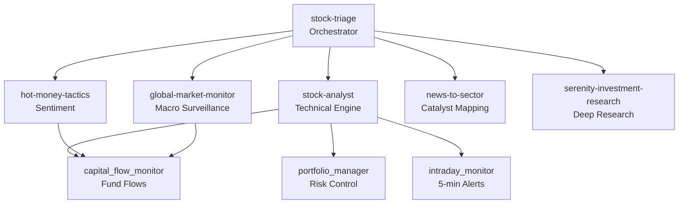

<picture>
  <source media="(prefers-color-scheme: dark)" srcset="https://img.shields.io/badge/A--Stock-Agent_System-1a1a2e?style=for-the-badge">
  
</picture>

[](https://www.python.org/)
[](LICENSE)
[](tests/)
[](scripts/smoke_test.py)

A multi-agent research system for China's A-share market. Nine specialized skills, a four-dimensional scoring engine, and a full decision pipeline — from global macro surveillance to portfolio risk management.

**Not a trading bot.** This system analyzes data and produces graded recommendations. It never places orders.

---

## Architecture



## Capabilities

| Module | What it does | Data Sources |
|--------|-------------|--------------|
| **stock-analyst** | Multi-timeframe technical analysis (day/week/60m/30m), sector scanning, screener | Tencent, Sina, yfinance |
| **hot-money-tactics** | Limit-up board analysis, sentiment cycles, sector rotation tracking | AkShare |
| **global-market-monitor** | US indices, VIX, Treasuries, commodities, FX, natural disasters → A-share impact | yfinance, USGS, GDACS |
| **news-to-sector** | Real-time news → 18 supply-chain impact maps with divergence analysis | SerpAPI |
| **serenity-investment-research** | Deep-dive: supply chain, financials, valuation scenarios, bear-case audit | cninfo, pypdf |
| **four-dim scorer** | Weighted S/A/B/C grading: technical(30%) × sentiment(25%) × catalyst(25%) × deep(20%) | All above |
| **hk-a-linkage** | AH premium spreads, HSI divergence, key HK stock movements | Tencent, yfinance |
| **capital-flow-monitor** | Northbound flows, institutional/retail flows, sector-level flows | Eastmoney |
| **portfolio-manager** | P&L tracking, stop-loss, trailing stops, concentration checks | Tencent |
| **intraday-monitor** | 5-minute alerts: limit-up/down, volume spikes, sudden moves | Tencent |
| **institution-tracker** | Research visits, analyst reports, insider trades | Eastmoney |
| **event-calendar** | Lockup expirations, dividends, policy windows | Eastmoney |
| **performance-tracker** | Signal accuracy tracking with grade-level breakdown | Tencent |

## Quick Start

### Install

```bash
git clone https://github.com/Eleven1111/a-stock-agent-system.git
cd a-stock-agent-system
pip install -e ".[charts,fundamentals,research,dev]"
```

### Verify

```bash
python scripts/smoke_test.py
python -m pytest -q tests/
```

### Run

```bash
# Grade a stock
python skills/stock-triage/scripts/four_dim_scorer.py 002156 通富微电 --json

# Global market scan
python skills/global-market-monitor/scripts/monitor.py --summary

# HK-A linkage
python skills/stock-triage/scripts/hk_a_linkage.py

# News → sector mapping
python skills/news-to-sector/scripts/main.py "焦煤期货主力合约触及涨停"

# Portfolio check
python skills/stock-triage/scripts/portfolio_manager.py --check

# 60-minute entry timing
python skills/stock-triage/scripts/four_dim_scorer.py 002156 通富微电 --timeframe 60
```

## Configuration

```bash
# Optional: enable Eastmoney APIs (fund flows, institutional data)
export NO_PROXY=.eastmoney.com,.gtimg.cn,.sinajs.cn

# Optional: enable news search
export SERPAPI_API_KEY=your_key
```

Source health tracking is built-in. When critical data is missing (e.g., yfinance unavailable), the system emits `"status": "insufficient_data"` and refuses to output directional advice.

## Cron Schedule

All jobs are defined in [`cron/hermes-cron-manifest.json`](cron/hermes-cron-manifest.json). Scheduling requires an external [Hermes Agent](https://hermes-agent.nousresearch.com) runtime — this repo provides the scripts; Hermes provides the clock.

```bash
python scripts/validate_cron_manifest.py cron/hermes-cron-manifest.json
```

| Time (CST) | Job | Frequency |
|------------|-----|-----------|
| 08:15 | Global pre-market scan | Workdays |
| 09:00–15:00 | Intraday alerts | Every 5 min |
| 09:45, 13:45, 14:45 | HK-A linkage | Workdays |
| 10:30, 14:30 | Capital flow monitor | Workdays |
| 15:08 | Four-dim batch scoring | Workdays |
| 15:10 | Portfolio risk check | Workdays |
| 15:25 | Triage → Kanban dispatch | Workdays |
| 22:30 | Global evening scan | Workdays |
| Sat 10:00 | Institution weekly | Weekly |
| Sun 10:00 | Performance weekly | Weekly |

## Output Format

Every scoring script returns structured JSON:

```json
{
  "code": "002156",
  "name": "通富微电",
  "confidence": "high",
  "data_coverage": {"realtime": true, "kline": true, "news": true, "valuation": true},
  "weighted": 7.2,
  "grade": "A",
  "emoji": "🟢🟢",
  "advice": "推荐 — 技术面偏多，有催化支撑",
  "scores": {
    "technical": {"score": 7.5, "ma5": 58.3, "rsi6": 55.1, "detail": "..."},
    "sentiment": {"score": 6.0, "turnover": 4.2, "detail": "..."},
    "catalyst": {"score": 8.0, "news_count": 3, "detail": "..."},
    "deep": {"score": 7.0, "pe": 35.2, "detail": "..."}
  }
}
```

The global monitor emits `source_health` and gates impact analysis on minimum data coverage:

```json
{
  "source_health": {
    "yfinance": {"status": "ok"},
    "serpapi": {"status": "ok"},
    "usgs": {"status": "ok"}
  },
  "impact": {
    "status": "ok",
    "alerts": [...],
    "summary": "利空：AI算力(-3), 半导体(-2)；利好：电力(+1)"
  }
}
```

If critical data is missing:

```json
{
  "source_health": {"yfinance": {"status": "failed", "error": "yfinance not installed"}},
  "impact": {
    "status": "insufficient_data",
    "alerts": [],
    "summary": "关键市场数据不足，禁止输出方向性A股判断"
  }
}
```

## Project Structure

```
a-stock-agent-system/
├── pyproject.toml              # Dependencies
├── config/scoring.yaml         # Scoring weights & risk parameters
├── cron/hermes-cron-manifest.json  # 11 scheduled jobs
├── scripts/
│   ├── smoke_test.py           # 6-test validation suite
│   └── validate_cron_manifest.py
├── tests/                      # 12 unit tests
├── skills/
│   ├── common/                 # Shared HTTP + atomic state store
│   ├── stock-triage/           # Orchestrator hub
│   ├── stock-analyst/          # Technical analysis engine
│   ├── hot-money-tactics/      # Sentiment & limit-up analysis
│   ├── global-market-monitor/  # Macro → A-share impact
│   ├── news-to-sector/         # Supply-chain catalyst mapping
│   ├── serenity-investment-research/  # Deep fundamental research
│   ├── a-stock-commands/       # Discord slash commands
│   ├── a-stock-data/           # Data source reference
│   └── a-stock-daily-report/   # Daily briefing template
└── AGENTS.md                   # Project constitution
```

## Design Principles

**Fail closed.** When critical data is missing, the system emits `insufficient_data` — never guesses.

**Confidence before conviction.** Every analysis carries a `confidence` field. Low confidence blocks directional advice.

**Scripts over services.** Every module is a standalone CLI script. No servers, no databases, no daemons. Pipe them together however you want.

**State is atomic.** All JSON writes go through `state_store.atomic_write_json()` with backup and crash recovery.

## Data Sources

| Source | Coverage | Requirements |
|--------|----------|-------------|
| Tencent `qt.gtimg.cn` | A-share/HK real-time quotes, K-lines | None |
| Yahoo Finance `yfinance` | US/global indices, VIX, commodities, FX | `pip install yfinance` |
| Eastmoney | Fund flows, institutional data, events | `NO_PROXY=.eastmoney.com` |
| Sina `hq.sinajs.cn` | A-share real-time (fallback) | None |
| SerpAPI | Global news search | `SERPAPI_API_KEY` |
| USGS | Earthquake monitoring | None |
| GDACS | Cyclone/flood/volcano alerts | None |

## Testing

```bash
pip install -e ".[dev]"
python -m pytest -q tests/        # 12 tests
python scripts/smoke_test.py      # 6 integration checks
python scripts/validate_cron_manifest.py
```

## Disclaimer

This system is for research and educational purposes only. It does **not** constitute investment advice. All outputs are derived from public data and quantitative rules. Past performance does not guarantee future results. The system never places trades or accesses brokerage accounts.

## License

MIT
