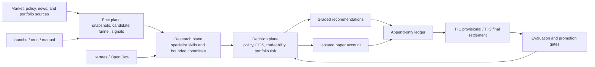

# A-Stock Agent System

[简体中文](README.zh-CN.md)

[](https://www.python.org/)
[](https://github.com/Eleven1111/a-stock-agent-system/actions/workflows/ci.yml)
[](LICENSE)

A research-first, multi-agent decision-support system for China's A-share
market. It combines deterministic market-data pipelines, 15 specialist skills,
bounded research agents, risk policy, an append-only signal ledger, and an
isolated paper account.

> [!IMPORTANT]
> This is not a trading bot. The repository does not connect to a brokerage or
> place live orders. It produces research artifacts, graded recommendations,
> and simulated fills. Missing, stale, or unverifiable evidence fails closed.

## Why this project

A-share research usually fails at the boundaries between data collection,
interpretation, risk control, and follow-up. This project makes those
boundaries explicit:

- market and policy inputs become versioned, point-in-time artifacts;
- candidates pass deterministic liquidity, tradeability, scoring, and
  portfolio gates;
- agents can interpret evidence, but cannot write facts or promote a strategy;
- recommendations, simulated fills, and T+1/T+3 outcomes share one auditable
  lineage;
- research strategies remain at zero live weight until their OOS, shadow,
  reconciliation, and human-approval gates pass.

## Quickstart

### Requirements

- Python 3.10 or newer
- macOS or Linux for the documented scheduler workflow
- network access for live market-data commands

### Install

```bash
git clone https://github.com/Eleven1111/a-stock-agent-system.git
cd a-stock-agent-system

# Replace python3.12 with any installed Python 3.10+ executable.
python3.12 -m venv .venv
source .venv/bin/activate
python -m pip install -e ".[charts,fundamentals,research,dev]"
```

### Verify the installation

```bash
python scripts/config_doctor.py
python scripts/validate_cron_manifest.py cron/hermes-cron-manifest.json
```

The current repository manifest, verified on 2026-08-04, contains **56
registered jobs, 44 enabled**. This describes the committed manifest, not the
installed state of any particular machine.

### Run an offline example

These commands use repository fixtures and do not require brokerage access:

```bash
export A_STOCK_STATE_HOME="${TMPDIR:-/tmp}/a-stock-agent-quickstart"
mkdir -p "$A_STOCK_STATE_HOME"

python skills/daban-stock-picker/scripts/daban_candidate_api.py --example --json
python skills/chanlun-backtest/scripts/research_gate.py --example --json
python scripts/evaluate_agent_harness.py --quiet
```

### Run a connected analysis

```bash
python skills/stock-triage/scripts/four_dim_scorer.py 600519 贵州茅台 --json
```

The scorer uses available providers and reports excluded dimensions or
`insufficient_data` when required evidence is unavailable. A missing provider
is never converted into a neutral score.

## How it works



The system deliberately separates three kinds of work:

1. **Fact plane** — deterministic adapters and DAG jobs produce immutable
   snapshots, source-health records, candidates, and ledger events.
2. **Research plane** — skills and model-backed experts interpret bounded
   evidence. Content-addressed documents and point-in-time retrieval bundles
   keep citations, access scope, conflicts, and source authority auditable.
   Their output is research, not a fact or an executable order.
3. **Decision plane** — deterministic policy applies freshness, tradeability,
   T+1, concentration, strategy-registry, OOS, and approval gates.

Every scheduled command re-enters `scripts/run_agent_dag.py`, so launchd,
Hermes, OpenClaw, system cron, and manual runs share the same dependency,
snapshot, lease, policy, and ledger rules.

## Core capabilities

| Area | Included capabilities |
|---|---|
| Market intelligence | Multi-timeframe technical analysis, global markets, AH linkage, capital flow, institutions, events, social attention |
| Candidate discovery | Dynamic A-share universe, natural-language recall, tail-window anomalies, limit-up and trend lanes |
| Scoring | Four-dimensional S/A/B/C grading: technical 30%, sentiment 15%, catalyst 30%, deep research 25% |
| Research | Serenity fundamental research, Chan-structure research, policy-intent decoding, multi-expert research committee, governed write-back and hybrid retrieval |
| Risk and lifecycle | Tradeability, A-share T+1, concentration, stops, candidate FSM, recommendation audit, settlement |
| Evaluation | IS/OOS walls, costs, controls, statistical gates, shadow promotion, expert calibration |
| Operations | Manifest scheduler, resumable DAG, provider health, state recovery, execution traces, delivery telemetry |
| Simulation | Independent ¥100,000 paper account with A-share lots, costs, limits, T+1, and `paper.*` events |

The capability list is intentionally broader than the live decision surface.
Research-only or explanatory modules cannot affect live ranking until their
promotion gates pass.

## Research committee

The research committee is a replayable, bounded workflow rather than an
unstructured group chat:

1. `research-dispatch` deterministically enqueues a task from DAG facts or an
   explicit user request.
2. `expert_runner.py next` claims one `(task, role)` lease with a fenced
   `claim_id`.
3. The role receives an immutable, content-addressed PIT evidence pack.
4. A finding is bound to its task, role, claim, output, tool inputs, and
   evidence hashes.
5. Conflicts can escalate only through bounded, round-specific evidence packs;
   adjudication is valid only in the configured final round.
6. Deterministic synthesis produces one idempotent terminal artifact.

A non-abstain finding remains review-only unless an independently written
approval under
`$A_STOCK_STATE_HOME/approvals/research-committee/` validates. Fundamental
inputs use append-only `fundamental_facts_v1` snapshots. The execution-plan
compiler requires fresh market, portfolio, quality, and strategy contexts plus
a bound synthesis or proposal approval, and still emits
`execution_eligible=false`.

```bash
# Explicitly enqueue a deep debate
python scripts/research_dispatch.py \
  --kind deep_debate \
  --code 600519 \
  --reason "Review the evidence and risk case"

# Claim and inspect work
python scripts/expert_runner.py next --worker hermes
python scripts/expert_runner.py status

# Deterministically synthesize ready tasks
python scripts/expert_runner.py synthesize

# Inspect research-only PIT, plan, and calibration entry points
python scripts/fundamentals_snapshot.py --help
python scripts/compile_research_execution_plan.py --help
python scripts/expert_calibration.py --help
```

See [the research committee guide](docs/research-committee-guide.md) and its
[runtime contract](skills/research-committee/SKILL.md).

## Safety model

The repository enforces the following boundaries:

- **No live execution.** There is no broker or automatic-order path.
- **Fail closed.** Missing critical evidence returns a blocked,
  `insufficient_data`, or abstained result.
- **Point-in-time inputs.** Future, stale, mutable, or lineage-mismatched
  evidence is rejected where it affects a decision.
- **Research is not authority.** Agent findings, strategy packs, Chan signals,
  reflexivity analysis, and paper results cannot self-promote.
- **Human approval is bound.** Approval artifacts are path-, identity-, time-,
  and content-bound; a reviewer name string is not approval.
- **Risk keeps priority.** A sufficiently supported `risk_redteam` veto remains
  authoritative in committee synthesis.
- **Delivery is not receipt.** Process success, provider acceptance, and actual
  user receipt are distinct states; the system does not invent a receipt.

For security reporting, see [SECURITY.md](SECURITY.md). Do not put credentials,
portfolio data, or exploitable details in a public issue.

## Scheduling and state

All scheduled work is declared in
[`cron/hermes-cron-manifest.json`](cron/hermes-cron-manifest.json). A launchd
heartbeat can invoke `scripts/cron_dispatch.py` every 60 seconds; the dispatcher
matches due enabled jobs, deduplicates by job and minute, and launches typed
argv with `shell=False`.

Set an explicit shared state root before running the multi-runtime workflow:

```bash
export A_STOCK_STATE_HOME="$HOME/.a-stock-agent"
export A_STOCK_STATE_ID="my-a-stock-cluster"
export A_STOCK_RUNTIME="hermes"  # or openclaw
```

Hermes and OpenClaw on one host must resolve the same `A_STOCK_STATE_HOME` and
`A_STOCK_STATE_ID`. A mismatch fails closed. Multi-host concurrency over a
shared volume is not a supported topology: leases and `fcntl` locks are
host-local and do not provide distributed exclusion. Runtime state,
credentials, holdings, ledgers, and private research artifacts must not be
committed.

Deployment, reconciliation, stop/start, and rollback instructions live in
[AUTOPILOT.md](AUTOPILOT.md). Treat the manifest as the repository job
definition and verify the installed scheduler separately.

## Configuration and providers

Versioned, non-secret policy lives under [`config/`](config/). Runtime secrets
belong in environment variables or the runtime's private environment file.

| Variable | Purpose | Required |
|---|---|---|
| `A_STOCK_STATE_HOME` | Shared runtime state root | Required for multi-runtime and approval workflows |
| `A_STOCK_STATE_ID` | Prevents accidental split-brain state | Required for OpenClaw reconciliation |
| `A_STOCK_RUNTIME` | Runtime identity: `hermes`, `openclaw`, or local | Recommended |
| `SERPAPI_API_KEY` | News search for catalyst analysis | Optional |
| `EASTMONEY_QGQP_B_ID` | Eastmoney natural-language stock recall | Optional |
| `WENCAI_API_KEY` | THS iwencai recall enhancement | Optional |
| `TAVILY_API_KEYS` | Serenity web-search provider | Optional |
| `BOCHA_API_KEYS` | Serenity web-search fallback | Optional |
| `SEARXNG_BASE_URLS` | Self-hosted search fallback | Optional |

Provider availability is observable through source-health artifacts and
`scripts/provider_doctor.py`. Missing optional providers disable or renormalize
their own dimension; they do not silently fabricate data.

## Validation

Run the same core checks used before a pull request:

```bash
pytest -q
python -m ruff check .
python scripts/validate_cron_manifest.py cron/hermes-cron-manifest.json
python -m compileall -q skills scripts tests
python scripts/check_maintainability_budget.py --base-ref origin/main
git diff --check
```

CI runs the supported Python matrix and CodeQL. The frozen agent harness tests
evidence discipline and authority boundaries; it does not prove investment
returns or open-world prediction accuracy.

## Documentation

| Topic | Document |
|---|---|
| Runtime architecture and hardening | [docs/architecture-hardening.md](docs/architecture-hardening.md) |
| Trading lifecycle and settlement | [docs/trading-lifecycle.md](docs/trading-lifecycle.md) |
| Portfolio research protocol | [docs/portfolio-research-protocol.md](docs/portfolio-research-protocol.md) |
| Paper trading | [docs/paper-trading-protocol.md](docs/paper-trading-protocol.md) |
| Research committee | [docs/research-committee-guide.md](docs/research-committee-guide.md) |
| Hot-money selection | [docs/hot-money-selection-protocol.md](docs/hot-money-selection-protocol.md) |
| Tail-close research lane | [docs/tail-close-strategy-protocol.md](docs/tail-close-strategy-protocol.md) |
| Stock-intelligence integration | [docs/stock-intelligence-integration.md](docs/stock-intelligence-integration.md) |
| Installed scheduler | [AUTOPILOT.md](AUTOPILOT.md) |
| Release history | [CHANGELOG.md](CHANGELOG.md) |

## Repository layout

```text
a-stock-agent-system/
├── config/                      # Versioned scoring, risk, and research policy
├── cron/                        # Runtime-neutral job manifest
├── docs/                        # Architecture and operating protocols
├── evals/                       # Frozen agent and strategy evaluations
├── scripts/                     # Scheduler, DAG, doctors, reports, CLIs
├── skills/                      # 15 specialist skills plus shared runtime code
├── tests/                       # Unit, integration, and contract tests
├── AGENTS.md                    # Repository operating contract
├── AUTOPILOT.md                 # Installed scheduler operations
└── pyproject.toml               # Python package and dependency metadata
```

## Contributing

Read [CONTRIBUTING.md](CONTRIBUTING.md) before opening a pull request. Changes
must preserve the fail-closed decision contract, include regression coverage
for behavior changes, and keep runtime state and credentials out of Git.

## Disclaimer

This project is for research and education only. It is not investment advice
and provides no guarantee of accuracy, completeness, timeliness, or return.
Users are responsible for their own decisions and risk.

## License

[MIT](LICENSE)
