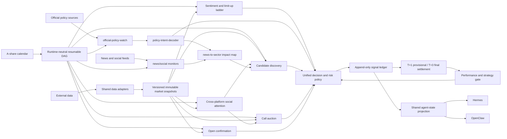

<picture>
  <source media="(prefers-color-scheme: dark)" srcset="https://img.shields.io/badge/A--Stock-Agent_System-1a1a2e?style=for-the-badge">
  
</picture>

[](https://www.python.org/)
[](LICENSE)
[](https://github.com/Eleven1111/a-stock-agent-system/actions/workflows/ci.yml)
[](scripts/smoke_test.py)

> Smoke badge reflects the latest connected validation. Offline runs may still
> time out on `global_monitor` or `hk_a_linkage` because they depend on live market data.

A multi-agent research system for China's A-share market. Thirteen repository skills, a four-dimensional scoring engine, and a full decision pipeline — from global macro surveillance to portfolio risk management, limit-up candidate gating, policy-intent decoding, and offline strategy validation.

**Not a trading bot.** This system analyzes data and produces graded recommendations. It never places orders.

---

## Architecture



## Capabilities

| Module | What it does | Data Sources |
|--------|-------------|--------------|
| **stock-analyst** | Multi-timeframe technical analysis (day/week/60m/30m), sector scanning, screener | Tencent, Sina, yfinance |
| **hot-money-tactics** | Limit-up board analysis, sentiment cycles, sector rotation tracking | AkShare |
| **eod-anomaly-scanner** | Full-market end-of-day scan for tail-window (14:30-15:00) volume/price anomalies, filtered by valuation and 60-day price position; next-morning `--confirm` mode checks the opening gap | Tencent, AkShare |
| **social-sentiment** | Eastmoney popularity/rising ranks plus Xueqiu discussion/follow ranks; cross-source confirmation, velocity and crowding divergence | Eastmoney, Xueqiu, optional Baidu |
| **daban-stock-picker** | Main-board 10cm limit-up candidate gate: first-board reseal, second-board weak-to-strong, six-question veto, tradeability. Thresholds read from a single source of truth shared with the backtest engine | `config/daban_thresholds.yaml`, structured JSON |
| **chanlun-backtest** | Offline research gate (IS/OOS wall, costs, controls, statistical tests) **plus** `chan_structure` signal generator: fractals → strokes → pivots → third buy/sell → MACD divergence. Signals earn live weight only after the gate passes | Tencent qfq K-line, local research-state JSON |
| **global-market-monitor** | US indices, VIX, Treasuries, commodities, FX, natural disasters → A-share sector views and stock watch mappings | yfinance, USGS, GDACS |
| **policy-intent-decoder** | Official policy source hierarchy, real-intent inference, transmission chain, beneficiary/pressure maps for stock-selection support | Official government/media sources |
| **news-to-sector** | Real-time news → 18 supply-chain impact maps with divergence analysis | SerpAPI |
| **serenity-investment-research** | Deep-dive: supply chain, financials, valuation scenarios, bear-case audit. The weighted scorecard flows back into the four-dim deep dimension via a freshness-decayed cache | cninfo, pypdf |
| **four-dim scorer** | Weighted S/A/B/C grading: technical(30%) × sentiment(15%) × catalyst(30%) × deep(25%). Deep dimension is Serenity-backed (not a PE bucket); technical dimension folds in gated Chan-structure signals | All above |
| **hk-a-linkage** | AH premium spreads, HSI divergence, key HK stock movements | Tencent, yfinance |
| **capital-flow-monitor** | Northbound flows, institutional/retail flows, sector-level flows | Eastmoney |
| **portfolio-manager** | Lot-level P&L, A-share T+1 enforcement, stop-loss, trailing stops, daban lane time-stop, take-profit target alerts, concentration checks | Tencent |
| **intraday-monitor** | Dynamic portfolio/subscription alerts; sold and cancelled names are removed automatically | Tencent |
| **institution-tracker** | Research visits, analyst reports, insider trades | Eastmoney |
| **event-calendar** | Lockup expirations, dividends, policy windows | Eastmoney |
| **performance-tracker** | Signal accuracy tracking with grade-level breakdown | Tencent |
| **discipline-review** | Daily buy-side plan-vs-fill diff (chased entries, oversized fills, unfollowed calls) plus live exit-discipline alerts and the account circuit-breaker state | Tencent |

## Policy Intent in the Architecture

`policy-intent-decoder` sits between the **information ingestion layer** and the
**stock-selection evidence layer**. It is not a trading strategy and does not
create runtime targets or holdings. It turns public first-party policy signals
into structured evidence that can be consumed by `news-to-sector`,
`stock-triage`, and the catalyst dimension of the four-dimensional scorer.

It answers two operational questions:

1. **Is this a valid first-party policy signal?** The decoder checks source
   rank, issuing body, document type, cross-agency coordination, and hard policy
   tools such as fiscal, monetary, regulatory, or industrial measures before
   treating the item as policy intent.
2. **How can the signal reach the candidate pool?** The decoder separates policy
   objective, implementation tool, constraints, beneficiary and pressure chains,
   transmission lag, and market-reaction evidence so a policy headline is never
   treated as a stock pick by itself.

Policy evidence only adds selection dimensions. It does not bypass market data,
liquidity, tradeability, announcement quality, portfolio-risk checks, or the
research gate. A strategy still cannot affect live ranking before its evidence
and OOS gate pass.

## Information and Policy Signal Loop

```text
first-party official sources
  -> official-policy-watch: poll, fingerprint, freshness gate every 10 minutes
  -> policy-intent-decoder: emit policy_intent_signal_v1
  -> news-to-sector: map supply-chain impact, divergence, beneficiaries, pressure
  -> stock-triage / four-dim scorer: consume as catalyst and context evidence
  -> unified policy / signal ledger / performance tracker
  -> realized outcomes feed back into strategy gates and weight calibration
```

The official source catalog lives at
[`skills/policy-intent-decoder/references/official-policy-sources.json`](skills/policy-intent-decoder/references/official-policy-sources.json).
It covers public first-party entry points such as the State Council policy
library and news pages, Xinhua, CSRC, PBOC, NDRC, MOF, MIIT, NFRA, SSE, and
SZSE. `official-policy-watch` runs every 10 minutes from 08:00 to 22:00 China
time on calendar days, not only trading days. Only fresh, unseen items with
policy-tool or industry-transmission evidence are promoted to decode signals.

When `news-to-sector` receives policy-like news, it treats the policy decoder as
the source-of-intent check before mapping industry impact. Broker views, social
posts, price moves, and news rewrites are reaction-layer evidence only; they do
not replace official sources for intent inference.

## Quick Start

### Prerequisites

Python **3.10 or higher** is required (macOS default Python 3.9 won't work).

```bash
# Check your Python version
python3 --version   # must be 3.10+
```

### Install

```bash
git clone https://github.com/Eleven1111/a-stock-agent-system.git
cd a-stock-agent-system

# Create and activate a virtual environment with Python 3.10+
python3.12 -m venv .venv        # or python3.10 / python3.11
source .venv/bin/activate

# Install the package with all extras
python -m pip install -e ".[charts,fundamentals,research,dev]"
```

> **macOS users**: If your system `python3` is still 3.9, install a newer version via
> `brew install python@3.12`, then use `python3.12` explicitly as shown above.

### Verify

```bash
python scripts/smoke_test.py
python -m pytest -q tests/
```

### Shared Hermes/OpenClaw state

Set the same state root in both runtimes so portfolio, recommendations, and
monitor subscriptions stay consistent:

```bash
export A_STOCK_STATE_HOME="$HOME/.a-stock-agent"
export A_STOCK_BACKUP_HOME="$HOME/.a-stock-agent-backups"
# Optional but recommended across multiple runtimes or hosts.
export A_STOCK_STATE_ID="my-a-stock-cluster"
```

OpenClaw fails closed when `A_STOCK_STATE_HOME` is not explicit or when a pinned
`A_STOCK_STATE_ID` does not match. Critical account JSON keeps bounded,
versioned snapshots outside the live state root; cache files are excluded.

When provider credentials live in a separate env file, generate OpenClaw jobs
with `--env-file /secure/a-stock.env`. Only the path is stored in the cron
command; credentials remain outside the repository and scheduler arguments.

See [A-share trading and monitoring lifecycle](docs/trading-lifecycle.md) for
T+1 enforcement, recommendation QC, and dynamic subscription behavior.

Both runtimes use the same execution surface:

```bash
python scripts/run_agent_dag.py global-preopen --runtime hermes
python scripts/run_agent_dag.py global-preopen --runtime openclaw
python scripts/agent_runtime_context.py
```

Across two machines, `A_STOCK_STATE_HOME` must be the same mounted filesystem,
not merely the same path string. Run leases and the canonical ledger cannot
coordinate two independent local disks.

Eastmoney traffic also shares a cross-machine rate limiter and circuit breaker.
The mounted filesystem must support atomic directory creation and same-filesystem
rename. Missing or stale lockup, margin, or holder-count evidence downgrades stock
advice to watch-only; a fresh last-known-good snapshot may bridge a transient
refresh failure. See [Eastmoney data-source resilience](docs/eastmoney-resilience.md).

### Run

```bash
# Grade a stock
python skills/stock-triage/scripts/four_dim_scorer.py 600519 贵州茅台 --json

# Global market scan
python skills/global-market-monitor/scripts/monitor.py --summary

# HK-A linkage
python skills/stock-triage/scripts/hk_a_linkage.py

# News → sector mapping
python skills/news-to-sector/scripts/main.py "焦煤期货主力合约触及涨停"

# Portfolio check
python skills/stock-triage/scripts/portfolio_manager.py --check

# 60-minute entry timing
python skills/stock-triage/scripts/four_dim_scorer.py 600519 贵州茅台 --timeframe 60

# Limit-up candidate gate
python skills/daban-stock-picker/scripts/daban_candidate_api.py --example --json

# Offline strategy research gate
python skills/chanlun-backtest/scripts/research_gate.py --example --json

# Point-in-time portfolio replay (requires persisted historical candidate snapshots)
python scripts/build_portfolio_research_input.py \
  --market-data portfolio_outcome_bars.json \
  --rules-locked-at 2026-06-21T09:34:00+08:00 \
  --output portfolio_backtest_input.json
python skills/chanlun-backtest/scripts/portfolio_backtest.py \
  --input portfolio_backtest_input.json --split 2025-01-01 \
  --artifact portfolio_backtest_oos.json --json
```

## Configuration

```bash
# Optional: relocate runtime data/cache/state (default: ~/.hermes)
export HERMES_HOME=/path/to/hermes

# Optional: override the Hermes Python used by BaoStock fallback scripts
export HERMES_PYTHON=/path/to/python3

# Optional: enable Eastmoney APIs (fund flows, institutional data)
export NO_PROXY=.eastmoney.com,.gtimg.cn,.sinajs.cn

# Optional: enable news search
export SERPAPI_API_KEY=your_key
```

All runtime paths resolve through `skills/common/paths.py` and honor `HERMES_HOME`, so the
system can run inside the repo, a sandbox, or CI without writing to the deploy machine's home.

Source health tracking is built-in. When critical data is missing (e.g., yfinance unavailable), the system emits `"status": "insufficient_data"` and refuses to output directional advice. When a scoring dimension lacks data (e.g., no `SERPAPI_API_KEY` → no catalyst), its weight is **renormalized away** instead of silently contributing a neutral 5.0; the dropped dimensions are listed in `excluded_dims`.

## Cron Schedule

All jobs are defined in [`cron/hermes-cron-manifest.json`](cron/hermes-cron-manifest.json).
Despite the historical filename, the manifest is shared by Hermes, OpenClaw,
system cron, and local runs.

The manifest routes every scheduled job through `scripts/run_agent_dag.py`.
The DAG reuses successful dependencies, reruns the scheduled target, and invokes
`agent_job_runner.py` internally under an atomic run lease. The runner writes
`$A_STOCK_STATE_HOME/cron/output/{job_id}/{run_id}.json`, creates an immutable
market snapshot for JSON output, and records `job_runs.json`. D0/D1 nodes also
persist raw inputs and read them back before ranking or policy evaluation. Routine jobs can
use `deliver=local` so scheduled output does not pollute active conversations.

Artifact v2 also records `trading_date`, `batch_id`, a fail-closed
`dependency_gate`, and the trading-day gate result. Non-trading days are
recorded as silent skips; uncovered calendar dates are blocked. Recommendations,
executions, monitor lifecycle changes, and
T+1 provisional and T+3 final settlements are correlated in the append-only
`signal_ledger.jsonl`. `agent_state_projector.py` exposes the same current state
to Hermes and OpenClaw.
See [`docs/architecture-hardening.md`](docs/architecture-hardening.md).

```bash
python scripts/validate_cron_manifest.py cron/hermes-cron-manifest.json
```

Deployment guardrails:

```bash
# Diagnose Gateway cwd/run_agent.py shadowing and schedule-state hazards.
python scripts/hermes_gateway_doctor.py --write-launcher

# Validate config, provider endpoints, and recover missing critical state.
python scripts/config_doctor.py
python scripts/provider_doctor.py --json
python scripts/state_doctor.py --runtime openclaw --recover

# Generate command-cron definitions without a model-backed isolated turn.
python scripts/generate_openclaw_cron.py \
  --state-home "$A_STOCK_STATE_HOME" \
  --state-id "$A_STOCK_STATE_ID"

# Recommended: reconcile against OpenClaw's active store. Existing named jobs
# are edited and only missing jobs are created. Omit --apply for a dry preview.
python scripts/generate_openclaw_cron.py \
  --state-home "$A_STOCK_STATE_HOME" \
  --state-id "$A_STOCK_STATE_ID" \
  --env-file "$A_STOCK_ENV_FILE" \
  --reconcile --apply
python scripts/cron_budget_report.py

# Emergency fallback when Hermes Gateway cron is unhealthy:
# generate system crontab lines that run isolated jobs directly.
python scripts/generate_system_crontab.py --repo-dir "$PWD" --hermes-home "$HERMES_HOME"
```

Cron jobs in this repo must be fully self-contained. Do not deploy jobs that require Gateway-side `{template}` injection; it can route execution back through in-process agent cron and reintroduce `run_agent.AIAgent` import conflicts.

### Dynamic stock-selection funnel

The scheduled workflow no longer scans a fixed symbol list:

1. **15:02 hot-money context** — cache the current limit-up ladder, sector clusters, and ladder date. Consumers reject missing, future, or stale context instead of silently applying it.
2. **15:07 close discovery** — official SSE/SZSE listings + Tencent full-market quotes, deterministic liquidity/tradeability filters, then qfq K-line enrichment. The same immutable input derives market breadth, top-two mainline sectors, and within-sector leaders. Missing timing/sector evidence closes only the limit-up lane; the trend lane remains available.
3. **08:45 pre-open bootstrap** — reuse the valid D0 pool. Only a cold start or expired pool triggers a full scan; this path never settles prior candidates with incomplete pre-open prices.
4. **09:15–09:25 auction** — collect minute-level Tencent five-level snapshots for the 500-name deep pool through 09:23, then take one lightweight full-eligible-universe snapshot at 09:24. Pool outsiders are descriptive research intelligence only; executable candidates still pass the configured shortlist and all strategy/risk gates.
5. **09:35 confirmation** — current quotes and tradeability reduce the shortlist to at most five policy-gated observations. Reports expose market timing, sector rank, leader rank, research/live status, and T+1 constraints.
6. **09:50 / 13:15 checkpoints** — bounded Tencent refreshes validate opening support and afternoon reflow for the five observations. They update research state only and never place trades or suggest a same-day exit.

Every eligible candidate is written to `candidate_lifecycle/YYYY-MM-DD.json`, including stage history, rejection reasons, and incremental T+1/T+3 outcomes. Full state is stored under `HERMES_HOME`; cron artifacts contain only compact summaries.

| Time (CST) | Job | Frequency |
|------------|-----|-----------|
| 08:15 | Global pre-market scan | Workdays |
| 08:45 | Candidate-pool cold-start guard | Workdays |
| 08:50 | Pre-open intelligence brief | Workdays |
| 09:15–09:24 | Auction snapshots | Every minute, workdays |
| 09:26 / 09:27 | Auction finalize / intelligence brief | Workdays |
| 09:35 | Open confirmation | Workdays |
| 09:36 | Open intelligence brief | Workdays |
| 09:50 | Mainline-leader support checkpoint | Workdays |
| 13:15 | Mainline-leader afternoon reflow checkpoint | Workdays |
| 09:30–11:30, 13:00–15:00 | Intraday alerts | Every 5 min (session-guarded) |
| 08:00–22:00 | Official policy watch | Every 10 min, calendar days |
| 09:25–11:30, 13:00–14:55 | Intraday news sweep | Offset every 5 min; stale data is archived without directional signals |
| 09:45, 13:45, 14:45 | HK-A linkage | Workdays |
| 10:30, 14:30 | Capital flow monitor | Workdays |
| 15:02 | Cache limit-up ladder and market temperature context | Workdays |
| 15:07 | Full-market candidate discovery | Workdays |
| 15:18 | Four-dim review of dynamic top 20 | Workdays |
| 15:25 | Portfolio risk check | Workdays |
| 15:35 | Triage → Kanban dispatch | Workdays |
| 22:30 | Global evening scan | Workdays |
| Sat 10:00 | Institution weekly | Weekly |
| 16:10 | T+1/T+3 signal settlement | Workdays |
| 09:40, 15:40, 16:40 | Shared agent-state projection | Workdays |
| Sun 10:00 | Performance weekly | Weekly |

## Output Format

Every scoring script returns structured JSON:

```json
{
  "code": "600519",
  "name": "贵州茅台",
  "confidence": "high",
  "data_coverage": {"realtime": true, "kline": true, "news": true, "valuation": true},
  "weighted": 7.2,
  "grade": "A",
  "emoji": "🟢🟢",
  "advice": "推荐 — 技术面偏多，有催化支撑",
  "scores": {
    "technical": {"score": 7.5, "ma5": 58.3, "rsi6": 55.1, "detail": "..."},
    "sentiment": {"score": 6.0, "turnover": 4.2, "detail": "..."},
    "catalyst": {"score": 8.0, "news_count": 3, "detail": "..."},
    "deep": {"score": 7.0, "pe": 35.2, "detail": "..."}
  }
}
```

The global monitor emits `source_health` and gates impact analysis on minimum data coverage:

```json
{
  "source_health": {
    "yfinance": {"status": "ok"},
    "serpapi": {"status": "ok"},
    "usgs": {"status": "ok"}
  },
  "impact": {
    "status": "ok",
    "alerts": [...],
    "summary": "利空：AI算力(-3), 半导体(-2)；利好：电力(+1)"
  }
}
```

If critical data is missing:

```json
{
  "source_health": {"yfinance": {"status": "failed", "error": "yfinance not installed"}},
  "impact": {
    "status": "insufficient_data",
    "alerts": [],
    "summary": "关键市场数据不足，禁止输出方向性A股判断"
  }
}
```

## Project Structure

```
a-stock-agent-system/
├── pyproject.toml              # Dependencies
├── config/scoring.yaml         # Scoring weights & risk parameters
├── config/candidate_selection.json # Dynamic-universe and funnel limits
├── cron/hermes-cron-manifest.json  # 39 runtime-neutral scheduled jobs
├── scripts/
│   ├── agent_job_runner.py     # Hermes/OpenClaw shared job entrypoint
│   ├── run_agent_dag.py        # Dependency ordering, retry, resume
│   ├── agent_state_projector.py # Ledger-to-agent current-state projection
│   ├── agent_runtime_context.py # Required state refresh for agent reasoning
│   ├── hermes_job_runner.py    # Backward-compatible runner implementation
│   ├── hermes_gateway_doctor.py # Deployment-side Gateway import/schedule diagnostics
│   ├── generate_system_crontab.py # System cron fallback generator
│   ├── smoke_test.py           # 11-test validation suite
│   ├── snapshot_gc.py          # Snapshot/artifact retention and capacity cleanup
│   └── validate_cron_manifest.py
├── tests/                      # Full regression suite
├── skills/
│   ├── common/                 # Adapters, snapshots, policy, ledger, shared state
│   ├── stock-triage/           # Orchestrator hub
│   ├── stock-analyst/          # Technical analysis engine
│   ├── hot-money-tactics/      # Sentiment & limit-up analysis
│   ├── social-sentiment/       # Cross-platform social attention evidence
│   ├── daban-stock-picker/     # Main-board 10cm limit-up candidate gate
│   ├── chanlun-backtest/       # Offline strategy research gate
│   ├── global-market-monitor/  # Macro → A-share impact
│   ├── policy-intent-decoder/  # Official policy intent and transmission chain
│   ├── news-to-sector/         # Supply-chain catalyst mapping
│   ├── serenity-investment-research/  # Deep fundamental research
│   ├── a-stock-commands/       # Discord slash commands
│   ├── a-stock-data/           # Data source reference
│   └── a-stock-daily-report/   # Daily briefing template
└── AGENTS.md                   # Project constitution
```

## Design Principles

**Fail closed.** When critical data is missing, the system emits `insufficient_data` — never guesses.

**Confidence before conviction.** Every analysis carries a `confidence` field. Low confidence blocks directional advice.

**Scripts over services.** Every module is a standalone CLI script. No servers, no databases, no daemons. Pipe them together however you want.

**State is recoverable.** JSON writes are atomic. Critical account state also
keeps bounded independent backups; missing or corrupt primary files recover
from validated snapshots instead of silently resetting to defaults.

**Earn your weight.** Chan-structure signals and tuned thresholds carry **zero live weight** until they pass the offline research gate (out-of-sample walled), tracked in `strategy_registry`. Live performance can only *retire* a strategy (gating by expectancy), never *refit* its entry rules — that separation is what keeps the system from overfitting to recent noise.

## Two Scoring Engines — Don't Confuse Them

The system separates **general stock health** from **hot-money board-hitting (打板)** by design:

| Engine | Module | Use for | Holding horizon |
|--------|--------|---------|-----------------|
| **Four-dim scorer** | `stock-triage/four_dim_scorer.py` | General health check (trend / valuation / catalyst) | Swing / mid-term |
| **Hot-money tactics** | `hot-money-tactics/analyze.py` | 打板 leader selection (连板 ladder, seal quality, auction seal, sentiment cycle) | T+1 (next-day) |

A 打板 leader is typically in its ignition phase — moving averages not yet bullish-aligned, PE
high or meaningless. The four-dim scorer's technical/valuation dimensions would **underrate** it.
**Route 打板 decisions through `hot-money-tactics`, not the four-dim scorer.**

### Win-rate is measured in 打板 terms

`performance_tracker.py` is the system's only feedback loop, so it uses **board-hitting-native
metrics** rather than 30/60-day swing returns:

- **隔日溢价 / 隔日收益** (T+1 open premium / close return) — where a 打板 trade actually exits
- **连板晋级率** (did T+1 limit-up again?)
- **Expectancy** = win-rate × avg-win − loss-rate × avg-loss, plus payoff ratio
- **Alpha vs CSI 300** — strips market beta so a number means *excess*, not "everything rose"

Returns are computed from **forward-adjusted (qfq) K-lines** so splits/dividends don't corrupt
them, and outcomes are resolved deterministically at the horizon — no "first touch +3% locks a
win forever" upward bias.

## Tradeability Gate

Before emitting directional advice, the four-dim scorer runs `tradeability.assess_tradeability()`:
a sealed 一字 limit-up board (`limit_up_sealed`) or a halted name (`halted`) is flagged as
**un-buyable** and the advice is prefixed accordingly — a high score on a board you can't actually
get filled on is not actionable.

## Data Sources

| Source | Coverage | Requirements |
|--------|----------|-------------|
| Tencent `qt.gtimg.cn` | A-share/HK real-time quotes, K-lines | None |
| Yahoo Finance `yfinance` | US/global indices, VIX, commodities, FX | `pip install yfinance` |
| Eastmoney | Fund flows, institutional data, events | `NO_PROXY=.eastmoney.com` |
| Sina `hq.sinajs.cn` | A-share real-time (fallback) | None |
| SerpAPI | Global news search | `SERPAPI_API_KEY` |
| USGS | Earthquake monitoring | None |
| GDACS | Cyclone/flood/volcano alerts | None |

## Testing

```bash
pip install -e ".[dev]"
python -m pytest -q tests/        # Full regression suite
python scripts/smoke_test.py      # 11 integration checks
python scripts/validate_cron_manifest.py
```

## Disclaimer

This system is for research and educational purposes only. It does **not** constitute investment advice. All outputs are derived from public data and quantitative rules. Past performance does not guarantee future results. The system never places trades or accesses brokerage accounts.

## License

MIT
