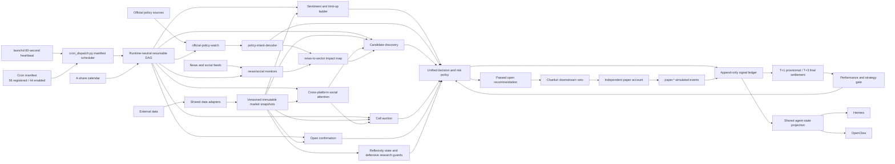

<picture>
  <source media="(prefers-color-scheme: dark)" srcset="https://img.shields.io/badge/A--Stock-Agent_System-1a1a2e?style=for-the-badge">
  
</picture>

[](https://www.python.org/)
[](LICENSE)
[](https://github.com/Eleven1111/a-stock-agent-system/actions/workflows/ci.yml)
[](scripts/smoke_test.py)

> Smoke badge reflects the latest connected validation. Offline runs may still
> time out on `global_monitor` or `hk_a_linkage` because they depend on live market data.

A multi-agent research system for China's A-share market. Fifteen repository skills, a four-dimensional scoring engine, and a full decision pipeline — from global macro surveillance to portfolio risk management, limit-up candidate gating, policy-intent decoding, and offline strategy validation.

**Not a trading bot.** This system analyzes data and produces graded recommendations. It never places live orders or connects to a brokerage. Its isolated paper account records simulated fills for research only.

---

## Architecture



The committed production entry has two scheduling layers. A launchd user agent
wakes every 60 seconds and invokes `scripts/cron_dispatch.py`; the dispatcher
reads the manifest, matches due enabled jobs, deduplicates each job per minute,
and launches it in a detached process with the repository virtual environment
first on `PATH`. Every launched command then re-enters `run_agent_dag.py`, so
calendar, dependency, snapshot, lease, policy, and ledger rules remain shared
across launchd, Hermes, OpenClaw, system cron, and manual runs. The installed
background-task contract and stop/start instructions live in
[`AUTOPILOT.md`](AUTOPILOT.md).

## Capabilities

| Module | What it does | Data Sources |
|--------|-------------|--------------|
| **stock-analyst** | Multi-timeframe technical analysis (day/week/60m/30m), sector scanning, screener | Tencent, Sina, yfinance |
| **hot-money-tactics** | Limit-up board analysis, sentiment cycles, sector rotation tracking | AkShare |
| **eod-anomaly-scanner** | Full-market end-of-day scan for tail-window (14:30-15:00) volume/price anomalies, filtered by valuation and 60-day price position; next-morning `--confirm` mode checks the opening gap | Tencent, AkShare |
| **social-sentiment** | Eastmoney popularity/rising ranks plus Xueqiu discussion/follow ranks; cross-source confirmation, velocity and crowding divergence | Eastmoney, Xueqiu, optional Baidu |
| **daban-stock-picker** | Main-board 10cm limit-up candidate gate: first-board reseal, second-board weak-to-strong, six-question veto, tradeability. Thresholds read from a single source of truth shared with the backtest engine | `config/daban_thresholds.yaml`, structured JSON |
| **chanlun-backtest** | Offline research gate (IS/OOS wall, costs, controls, statistical tests) **plus** `chan_structure` signal generator: fractals → strokes → pivots → third buy/sell → MACD divergence. Passing research is necessary but not sufficient for live weight; shadow, empirical, broker and human-promotion gates follow | Tencent qfq K-line, local research-state JSON |
| **global-market-monitor** | US indices, VIX, Treasuries, commodities, FX, natural disasters → A-share sector views and stock watch mappings | yfinance, USGS, GDACS |
| **policy-intent-decoder** | Official policy source hierarchy, real-intent inference, transmission chain, beneficiary/pressure maps for stock-selection support | Official government/media sources |
| **news-to-sector** | Real-time news → 18 supply-chain impact maps with divergence analysis | SerpAPI |
| **serenity-investment-research** | Deep-dive: supply chain, financials, valuation scenarios, bear-case audit. Five request-routing modes (theme scan, single-company challenge, candidate comparison, research-partner dialogue, learning mode); theme-scan reports separate a supply-chain-tier ranking from the company ranking and answer five questions per finalist. Deep reports must clear a hard lint floor (`report_lint.py`: ≥3 value-chain tiers, ≥20-name candidate universe, ≥25-source evidence ledger, a mandatory "downgraded consensus picks" section). The weighted scorecard flows back into the four-dim deep dimension via a freshness-decayed cache | cninfo, pypdf, `web_search.py` |
| **research-committee** | Multi-expert research plane with claim fencing, immutable PIT evidence packs, bounded round-specific debate, fail-closed adjudication, independently bound approvals, deterministic single-winner synthesis, and research-only execution-plan/calibration artifacts | Internal; consumes immutable evidence from other skills |
| **four-dim scorer** | Weighted S/A/B/C grading: technical(30%) × sentiment(15%) × catalyst(30%) × deep(25%). Deep dimension is Serenity-backed (not a PE bucket); technical dimension folds in gated Chan-structure signals and (at zero weight until gated) emotion-cycle features | All above |
| **hk-a-linkage** | AH premium spreads, HSI divergence, key HK stock movements | Tencent, yfinance |
| **capital-flow-monitor** | Northbound flows, institutional/retail flows, sector-level flows | Eastmoney |
| **portfolio-manager** | Lot-level P&L, A-share T+1 enforcement, stop-loss, trailing stops, daban lane time-stop, take-profit target alerts, concentration checks | Tencent |
| **intraday-monitor** | Dynamic portfolio/subscription alerts; sold and cancelled names are removed automatically | Tencent |
| **institution-tracker** | Research visits, analyst reports, insider trades | Eastmoney |
| **event-calendar** | Lockup expirations, dividends, policy windows | Eastmoney |
| **performance-tracker** | Signal accuracy tracking with grade-level breakdown | Tencent |
| **discipline-review** | Daily buy-side plan-vs-fill diff (chased entries, oversized fills, unfollowed calls) plus live exit-discipline alerts and the account circuit-breaker state | Tencent |
| **nl-screening recall** | Natural-language stock screening as a second candidate-discovery channel: Eastmoney AI stock picker (free, gated on `EASTMONEY_QGQP_B_ID`; reports itself as disabled when unset) plus optional THS iwencai OpenAPI enhancement (`WENCAI_API_KEY`). Candidates carry a `recall_source` tag and still pass every candidate FSM/policy gate — this channel never bypasses them | Eastmoney AI picker, THS iwencai |
| **interactive-qa evidence** | Investor-relations Q&A from 互动易 (Shenzhen, fail-closed) and 上证e互动 (Shanghai, best-effort; degrades to `sse_unavailable`) feeds an "investor attention" dimension into candidate/holding evidence packs | 互动易, 上证e互动 |
| **NewsNow aggregator** | Low-rank attention signals (S1/S2, not authoritative evidence) from five default feeds — 财联社热门, 雪球热门股票, 华尔街见闻快讯, 金十数据, 格隆汇事件 — via a self-hostable NewsNow instance; the L1 rule engine still must match keywords before promoting anything | NewsNow (public demo or self-hosted, `NEWSNOW_BASE_URL`) |
| **strategy-packs (declarative)** | Two built-in, regime-filtered explanatory strategy packs — `dragon_head` and `emotion_cycle` — surfaced as `strategy_pack_hints` in the evidence pack. Explanatory only: `influences_live_ranking=false`; live weight requires the complete research → shadow → manual-pilot → live promotion chain | `config/strategy_packs/*.yaml` |
| **emotion-cycle features** | Five deterministic, fail-closed technical features (60-day volume percentile, single-day volume-spike ≥5x flag, MA-convergence, ATR-contraction percentile, composite top/bottom detector); zero live weight until `emotion_cycle:v1` completes the promotion chain in `strategy_registry` | Tencent qfq K-line |
| **reflexivity guard** | Research-only, defensive response to crowding and inferred player interaction. It may veto or reduce exposure when frozen evidence indicates leader isolation, false consensus, or institutional distribution; positive phases never add score or bypass strategy promotion | Immutable candidate snapshots, `config/reflexivity_strategy.json` |
| **paper-trading** | Independent ¥100,000 research account. Only candidates that already pass recommendation and open confirmation are evaluated; Chanlun is a downstream veto only and cannot select, rank, boost, or place live orders. Simulated fills obey A-share lots, costs, limits, concentration, and T+1 discipline | Open-confirmation signals, Tencent qfq K-line, `paper.*` ledger events |
| **web-search adapter** | Multi-provider fallback chain (Tavily → Bocha 博查 → SearXNG) with per-provider key rotation on 401/402/429; used by Serenity's Harvest Sources step instead of ad hoc in-session browsing | Tavily, Bocha, SearXNG |
| **recommendation feedback loop** | `scripts/recommendation_feedback.py` records `useful` / `not_useful` verdicts per signal id; guardrail divergences (raw vs. final action) carry structured machine-readable reason codes, audited by `recommendation_audit.py --audit-violations`; feedback stats feed `score_calibration_report.py` | `signal_ledger.jsonl` |

## Policy Intent in the Architecture

`policy-intent-decoder` sits between the **information ingestion layer** and the
**stock-selection evidence layer**. It is not a trading strategy and does not
create runtime targets or holdings. It turns public first-party policy signals
into structured evidence that can be consumed by `news-to-sector`,
`stock-triage`, and the catalyst dimension of the four-dimensional scorer.

It answers two operational questions:

1. **Is this a valid first-party policy signal?** The decoder checks source
   rank, issuing body, document type, cross-agency coordination, and hard policy
   tools such as fiscal, monetary, regulatory, or industrial measures before
   treating the item as policy intent.
2. **How can the signal reach the candidate pool?** The decoder separates policy
   objective, implementation tool, constraints, beneficiary and pressure chains,
   transmission lag, and market-reaction evidence so a policy headline is never
   treated as a stock pick by itself.

Policy evidence only adds selection dimensions. It does not bypass market data,
liquidity, tradeability, announcement quality, portfolio-risk checks, or the
research gate. A strategy still cannot affect live ranking before its evidence,
OOS, shadow, broker-reconciliation and promotion gates pass.

## Information and Policy Signal Loop

```text
first-party official sources
  -> official-policy-watch: poll, fingerprint, freshness gate every 10 minutes
  -> policy-intent-decoder: emit policy_intent_signal_v1
  -> news-to-sector: map supply-chain impact, divergence, beneficiaries, pressure
  -> stock-triage / four-dim scorer: consume as catalyst and context evidence
  -> unified policy / signal ledger / performance tracker
  -> realized outcomes feed back into strategy gates and weight calibration
```

The official source catalog lives at
[`skills/policy-intent-decoder/references/official-policy-sources.json`](skills/policy-intent-decoder/references/official-policy-sources.json).
It covers public first-party entry points such as the State Council policy
library and news pages, Xinhua, CSRC, PBOC, NDRC, MOF, MIIT, NFRA, SSE, and
SZSE. `official-policy-watch` runs every 10 minutes from 08:00 to 22:00 China
time on calendar days, not only trading days. Only fresh, unseen items with
policy-tool or industry-transmission evidence are promoted to decode signals.

When `news-to-sector` receives policy-like news, it treats the policy decoder as
the source-of-intent check before mapping industry impact. Broker views, social
posts, price moves, and news rewrites are reaction-layer evidence only; they do
not replace official sources for intent inference.

## L2 News Evidence Auto-Mount

`news_pipeline.read_graded_news(code=, sectors=, days=, limit=)` looks up
already-graded news by stock code or sector, and `evidence_pack.py` attaches a
`news_evidence` section to candidate and holding evidence packs (fail-open,
with an explicit `ok` / `empty` / `unavailable` status — never a silent gap).
The grading model itself decides whether a given news item names specific
stock codes (the `affected_codes` field); nothing currently cross-checks that
judgment against the source text, so treat `affected_codes` as a hint rather
than ground truth for high-conviction candidates.

## Second Candidate-Discovery Channel: Natural-Language Screening

`skills/common/nl_screening.py` adds a second recall channel alongside the
close-price/liquidity funnel: Eastmoney's free AI stock picker (gated on
`EASTMONEY_QGQP_B_ID`; the channel reports itself as `disabled` with a clear
reason when the cookie is not configured) and an optional THS iwencai OpenAPI
enhancement (`WENCAI_API_KEY`). Candidates surfaced this way carry a
`recall_source` tag but still pass through the same candidate FSM and policy
gates as the close-discovery funnel — this channel never bypasses any gate.
Screening condition templates (generic, no hardcoded stocks or sectors) live
in [`config/nl_screening.yaml`](config/nl_screening.yaml).

## Quick Start

### Prerequisites

Python **3.10 or higher** is required (macOS default Python 3.9 won't work).

```bash
# Check your Python version
python3 --version   # must be 3.10+
```

### Install

```bash
git clone https://github.com/Eleven1111/a-stock-agent-system.git
cd a-stock-agent-system

# Create and activate a virtual environment with Python 3.10+
python3.12 -m venv .venv        # or python3.10 / python3.11
source .venv/bin/activate

# Install the package with all extras
python -m pip install -e ".[charts,fundamentals,research,dev]"
```

> **macOS users**: If your system `python3` is still 3.9, install a newer version via
> `brew install python@3.12`, then use `python3.12` explicitly as shown above.

### Verify

```bash
python scripts/smoke_test.py
python -m pytest -q tests/
```

### Shared Hermes/OpenClaw state

Set the same state root in both runtimes so portfolio, recommendations, and
monitor subscriptions stay consistent:

```bash
export A_STOCK_STATE_HOME="$HOME/.a-stock-agent"
export A_STOCK_BACKUP_HOME="$HOME/.a-stock-agent-backups"
# Optional but recommended across multiple runtimes or hosts.
export A_STOCK_STATE_ID="my-a-stock-cluster"
```

OpenClaw fails closed when `A_STOCK_STATE_HOME` is not explicit or when a pinned
`A_STOCK_STATE_ID` does not match. Critical account JSON keeps bounded,
versioned snapshots outside the live state root; cache files are excluded.

When provider credentials live in a separate env file, generate OpenClaw jobs
with `--env-file /secure/a-stock.env`. Only the path is stored in the cron
command; credentials remain outside the repository and scheduler arguments.

See [A-share trading and monitoring lifecycle](docs/trading-lifecycle.md) for
T+1 enforcement, recommendation QC, and dynamic subscription behavior.

Both runtimes use the same execution surface:

```bash
python scripts/run_agent_dag.py global-preopen --runtime hermes
python scripts/run_agent_dag.py global-preopen --runtime openclaw
python scripts/agent_runtime_context.py
```

Across two machines, `A_STOCK_STATE_HOME` must be the same mounted filesystem,
not merely the same path string. Run leases and the canonical ledger cannot
coordinate two independent local disks.

Eastmoney traffic also shares a cross-machine rate limiter and circuit breaker.
The mounted filesystem must support atomic directory creation and same-filesystem
rename. Missing or stale lockup, margin, or holder-count evidence downgrades stock
advice to watch-only; a fresh last-known-good snapshot may bridge a transient
refresh failure. See [Eastmoney data-source resilience](docs/eastmoney-resilience.md).

### Run

```bash
# Grade a stock
python skills/stock-triage/scripts/four_dim_scorer.py 600519 贵州茅台 --json

# Global market scan
python skills/global-market-monitor/scripts/monitor.py --summary

# HK-A linkage
python skills/stock-triage/scripts/hk_a_linkage.py

# News → sector mapping
python skills/news-to-sector/scripts/main.py "焦煤期货主力合约触及涨停"

# Portfolio check
python skills/stock-triage/scripts/portfolio_manager.py --check

# 60-minute entry timing
python skills/stock-triage/scripts/four_dim_scorer.py 600519 贵州茅台 --timeframe 60

# Limit-up candidate gate
python skills/daban-stock-picker/scripts/daban_candidate_api.py --example --json

# Offline strategy research gate
python skills/chanlun-backtest/scripts/research_gate.py --example --json

# Cost-adjusted ablation of defensive reflexivity guards
python scripts/reflexivity_report.py \
  --outcome t3_close_ret --round-trip-cost-bps 20

# Isolated paper account: recommendation/open confirmation precede the Chanlun veto
python skills/paper-trading/scripts/paper_trading_runner.py --phase open --json
python skills/paper-trading/scripts/paper_trading_runner.py --phase monitor --json
python skills/paper-trading/scripts/paper_trading_runner.py --phase close --json
python scripts/paper_trading_report.py

# Point-in-time portfolio replay (requires persisted historical candidate snapshots)
python scripts/build_portfolio_research_input.py \
  --market-data portfolio_outcome_bars.json \
  --rules-locked-at 2026-06-21T09:34:00+08:00 \
  --output portfolio_backtest_input.json
python skills/chanlun-backtest/scripts/portfolio_backtest.py \
  --input portfolio_backtest_input.json --split 2025-01-01 \
  --artifact portfolio_backtest_oos.json --json
```

See the [hot-money selection protocol](docs/hot-money-selection-protocol.md)
for the defensive reflexivity boundary and the
[paper-trading protocol](docs/paper-trading-protocol.md) for entry ordering,
A-share execution rules, audit events, and research-report semantics.

## Configuration

```bash
# Optional: relocate runtime data/cache/state (default: ~/.hermes)
export HERMES_HOME=/path/to/hermes

# Optional: override the Hermes Python used by BaoStock fallback scripts
export HERMES_PYTHON=/path/to/python3

# Optional: enable Eastmoney APIs (fund flows, institutional data)
export NO_PROXY=.eastmoney.com,.gtimg.cn,.sinajs.cn

# Optional: enable news search
export SERPAPI_API_KEY=your_key

# Optional: enable the natural-language screening recall channel
export EASTMONEY_QGQP_B_ID=your_eastmoney_cookie_b_id
export WENCAI_API_KEY=your_ths_iwencai_key

# Optional: point NewsNow at a self-hosted instance instead of the public demo
export NEWSNOW_BASE_URL=https://your-newsnow-instance

# Optional: web-search fallback chain (comma-separated for multi-key rotation)
export TAVILY_API_KEYS=key1,key2
export BOCHA_API_KEYS=key1,key2
export SEARXNG_BASE_URLS=https://searxng1.example.com,https://searxng2.example.com
```

All runtime paths resolve through `skills/common/paths.py` and honor `HERMES_HOME`, so the
system can run inside the repo, a sandbox, or CI without writing to the deploy machine's home.

Source health tracking is built-in. When critical data is missing (e.g., yfinance unavailable), the system emits `"status": "insufficient_data"` and refuses to output directional advice. When a scoring dimension lacks data (e.g., no `SERPAPI_API_KEY` → no catalyst), its weight is **renormalized away** instead of silently contributing a neutral 5.0; the dropped dimensions are listed in `excluded_dims`.

## Cron Schedule

All jobs are defined in [`cron/hermes-cron-manifest.json`](cron/hermes-cron-manifest.json).
Despite the historical filename, the manifest is shared by Hermes, OpenClaw,
system cron, and local runs.

The current manifest registers **54 jobs, 42 enabled**. On the documented macOS
deployment, launchd invokes `scripts/cron_dispatch.py` once per minute; the
dispatcher handles cron matching and same-minute deduplication before starting
the due DAG command. `AUTOPILOT.md` is the source of truth for the installed
background process, while the manifest remains the source of truth for job
definitions, enabled state, schedules, delivery mode, and commands.

Five disabled, research-only jobs define the new tail-close lane: 14:35 PIT
preparation, 14:50 decision, 15:05 independent after-hours capability audit,
15:06 simulated-fill reconciliation, and 15:31 after-hours reconciliation.
They stay disabled until the strict
PIT input capability, precommitted OOS gate, and real shadow evidence pass;
their runtime has zero live weight and no broker or automatic-order path.

### Typed commands

Every enabled job is defined by argv arrays, not shell strings:
`command_argv` for the scheduler entry and `run.argv` for the isolated business
process. Both execute with `shell=False`. The validator rejects pipes,
redirection, command substitution, undeclared environment expansion, and
undeclared template variables instead of executing them, and the dispatcher
fails closed on a missing executable or a cwd outside the repository. The legacy
string `command` / `run.command` form is accepted for one migration release, and
only on disabled jobs; it is never auto-promoted back to a shell execution path.

The manifest routes every scheduled job through `scripts/run_agent_dag.py`.
The DAG reuses successful dependencies, reruns the scheduled target, and invokes
`agent_job_runner.py` internally under an atomic run lease. The runner writes
`$A_STOCK_STATE_HOME/cron/output/{job_id}/{run_id}.json`, creates an immutable
market snapshot for JSON output, and records `job_runs.json`. D0/D1 nodes also
persist raw inputs and read them back before ranking or policy evaluation. Routine jobs can
use `deliver=local` so scheduled output does not pollute active conversations.

Artifact v2 also records `trading_date`, `batch_id`, a fail-closed
`dependency_gate`, and the trading-day gate result. Non-trading days are
recorded as silent skips; uncovered calendar dates are blocked. Recommendations,
executions, monitor lifecycle changes, and
T+1 provisional and T+3 final settlements are correlated in the append-only
`signal_ledger.jsonl`. `agent_state_projector.py` exposes the same current state
to Hermes and OpenClaw.

### Execution trace

One scheduled run now emits a single append-only event stream at
`$A_STOCK_STATE_HOME/cron/execution_trace.jsonl`, written by
[`skills/common/execution_trace.py`](skills/common/execution_trace.py). Event
types are `dispatch.claimed`, `job.started`, `gate.passed`, `gate.blocked`,
`agent.started`, `agent.finished`, `job.finished`, `delivery.attempted`,
`delivery.provider_accepted` and `delivery.failed`. Every event carries
`trace_id`, `batch_id`, `run_id`, `job_id`, `correlation_id`, `trading_date`,
`runtime`, `event_type`, `occurred_at`, `status`, `artifact_ref`,
`source_versions` and `reason_codes`.

The dispatcher mints one `trace_id` per launch and exports it, so a DAG and all
of its dependency jobs share a trace while keeping distinct `run_id`s. The field
set is a strict allowlist: prompts, stdout, stderr, secrets and external response
bodies have no representable slot.

Three properties are deliberate:

- **The trace is not a fact ledger.** `signal_ledger.jsonl` keeps ownership of
  business events. A trace write failure emits an explicit `trace_degraded`
  warning and changes no gate, recommendation or delivery decision.
- **Delivery has three distinct states.** "the process returned success", "the
  channel accepted the request" and "the user received it" are different facts.
  There is no receipt source today, so there is no `delivery.received` event
  type at all and no code path can fabricate one.
- **Shadow first.** The trace is observational. Roll it back with
  `A_STOCK_EXECUTION_TRACE=off`; jobs then write only their original artifacts.

Diagnose a window with:

```bash
python scripts/execution_trace_report.py --coverage
```

The report gives completion rate, blocked/failed distribution, dispatch-to-start
and run-duration percentiles, delivery attempts versus provider acceptances, and
`trace_gaps` (missing start, missing terminal, duplicate terminal). The shadow
gate is passed only when there are no duplicate terminals, no terminal without a
start, and the P95 run duration has not regressed against the pre-trace baseline
over five consecutive trading days.

### Bounded research agents

Research-plane agent turns run through
[`skills/common/agent_runtime_adapter.py`](skills/common/agent_runtime_adapter.py)
against the contract in
[`agent_run_contract.py`](skills/common/agent_run_contract.py). Hermes and
OpenClaw implement the same interface and are covered by one conformance suite.

A turn receives a task id, role, evidence-pack reference, allowed tools, allowed
state reads, forbidden state writes, an output schema, an output-size cap and a
deadline. It returns exactly one terminal status — `completed`, `abstained`,
`blocked` or `failed` — plus evidence refs, confidence, reason codes, tool usage
and model usage.

An agent turn cannot become a fact. Only a `completed` or `abstained` turn
produces a finding; timeouts, schema errors, unresolvable evidence refs,
over-long output, undeclared tool use and any declared fact-plane write map to a
named `blocked`/`failed` state with no finding, so a failure can never be merged
into a synthesis as neutral or supporting evidence. Findings that claim live
ranking weight, request a T+1 bypass or ask for a strategy promotion are blocked
outright.

Replay the frozen evaluation set with:

```bash
python scripts/evaluate_agent_harness.py --quiet
```

The dataset in [`evals/agent_harness/`](evals/agent_harness) holds 32 fixed
cases covering missing / stale / future-dated evidence, conflicting experts,
single low-grade sources, unresolvable evidence refs, T+1 and promotion bypass
attempts, research-only overreach, no-signal, provider degradation, over-long
output, correct abstention, and normal support / oppose / neutral findings. Hard
metrics are enforced in CI: 100% schema validity, 100% evidence-ref
resolvability, zero fact-plane writes, 100% correct blocking on fail-closed
cases, zero research-only leaks into live ranking, 100% correct abstention, and
zero divergence between the Hermes and OpenClaw adapters. Replay is deterministic
— a frozen clock, fixture packs, no production state, no network and no model
call. **The set validates evidence discipline and authority boundaries only; it
makes no claim about investment returns or prediction accuracy.**
See [`docs/architecture-hardening.md`](docs/architecture-hardening.md).

The isolated paper workflow starts after the 09:35 recommendation and
tradeability confirmation: 09:37 evaluates the Chanlun downstream veto,
session monitors apply the existing exit discipline, and 15:25 records NAV.
It writes only `paper.*` research events and never connects to a brokerage.

```bash
python scripts/validate_cron_manifest.py cron/hermes-cron-manifest.json
```

Deployment guardrails:

```bash
# Diagnose Gateway cwd/run_agent.py shadowing and schedule-state hazards.
python scripts/hermes_gateway_doctor.py --write-launcher

# Validate config, provider endpoints, and recover missing critical state.
python scripts/config_doctor.py
python scripts/provider_doctor.py --json
python scripts/state_doctor.py --runtime openclaw --recover

# Generate command-cron definitions without a model-backed isolated turn.
python scripts/generate_openclaw_cron.py \
  --state-home "$A_STOCK_STATE_HOME" \
  --state-id "$A_STOCK_STATE_ID" \
  --delivery-to "$A_STOCK_DELIVERY_TO"

# Recommended: reconcile against OpenClaw's active store. Existing named jobs
# are edited and only missing jobs are created. Omit --apply for a dry preview.
python scripts/generate_openclaw_cron.py \
  --state-home "$A_STOCK_STATE_HOME" \
  --state-id "$A_STOCK_STATE_ID" \
  --env-file "$A_STOCK_ENV_FILE" \
  --delivery-to "$A_STOCK_DELIVERY_TO" \
  --reconcile --apply
python scripts/cron_budget_report.py

# Emergency fallback when Hermes Gateway cron is unhealthy:
# generate system crontab lines that run isolated jobs directly.
python scripts/generate_system_crontab.py --repo-dir "$PWD" --hermes-home "$HERMES_HOME"
```

Cron jobs in this repo must be fully self-contained. Do not deploy jobs that require Gateway-side `{template}` injection; it can route execution back through in-process agent cron and reintroduce `run_agent.AIAgent` import conflicts.

### Dynamic stock-selection funnel

The scheduled workflow no longer scans a fixed symbol list:

1. **15:02 hot-money context** — cache the current limit-up ladder, sector clusters, and ladder date. Consumers reject missing, future, or stale context instead of silently applying it.
2. **15:07 close discovery** — official SSE/SZSE listings + Tencent full-market quotes, deterministic liquidity/tradeability filters, then qfq K-line enrichment. The same immutable input derives market breadth, top-two mainline sectors, and within-sector leaders. Missing timing/sector evidence closes only the limit-up lane; the trend lane remains available.
3. **08:45 pre-open bootstrap** — reuse the valid D0 pool. Only a cold start or expired pool triggers a full scan; this path never settles prior candidates with incomplete pre-open prices.
4. **09:15–09:25 auction** — collect minute-level Tencent five-level snapshots for the 500-name deep pool through 09:23, then take one lightweight full-eligible-universe snapshot at 09:24. Pool outsiders are descriptive research intelligence only; executable candidates still pass the configured shortlist and all strategy/risk gates.
5. **09:35 confirmation** — current quotes and tradeability reduce the shortlist to at most five policy-gated observations. Reports expose market timing, sector rank, leader rank, research/live status, and T+1 constraints.
6. **09:50 / 13:15 checkpoints** — bounded Tencent refreshes validate opening support and afternoon reflow for the five observations. They update research state only and never place trades or suggest a same-day exit.

Every eligible candidate is written to `candidate_lifecycle/YYYY-MM-DD.json`, including stage history, rejection reasons, and incremental T+1/T+3 outcomes. Full state is stored under `HERMES_HOME`; cron artifacts contain only compact summaries.

| Time (CST) | Job | Frequency |
|------------|-----|-----------|
| 08:15 | Global pre-market scan | Workdays |
| 08:45 | Candidate-pool cold-start guard | Workdays |
| 08:50 | Pre-open intelligence brief | Workdays |
| 09:15–09:24 | Auction snapshots | Every minute, workdays |
| 09:26 / 09:27 | Auction finalize / intelligence brief | Workdays |
| 09:35 | Open confirmation | Workdays |
| 09:36 | Open intelligence brief | Workdays |
| 09:37 | Paper-account entry evaluation and simulated open | Workdays |
| 09:50 | Mainline-leader support checkpoint | Workdays |
| 13:15 | Mainline-leader afternoon reflow checkpoint | Workdays |
| 09:00–11:45, 13:00–14:45 | Intraday alerts | Every 15 min (session-guarded) |
| 10:08–11:53, 13:08–14:53 | Paper-account position monitor | Every 15 min, workdays |
| 08:00–22:00 | Official policy watch | Every 10 min, calendar days |
| 09:02–11:47, 13:02–14:47 | Intraday news sweep | Every 15 min; the script applies its own session/SLA guard and archives stale data without directional signals |
| 09:45, 13:45, 14:45 | HK-A linkage | Workdays |
| 10:30, 14:30 | Capital flow monitor | Workdays |
| 15:02 | Cache limit-up ladder and market temperature context | Workdays |
| 15:07 | Full-market candidate discovery | Workdays |
| 15:15 | Candidate-pool freshness check | Workdays |
| 15:18 | Four-dim review of dynamic top 20 | Workdays |
| 15:25 | Portfolio risk check and paper-account close/NAV | Workdays |
| 15:35 | Closing triage digest | Workdays |
| 15:50 | Queued research-task dispatch | Workdays |
| 22:30 | Global evening scan | Workdays |
| Sat 10:00 | Institution weekly | Weekly |
| 16:10 | T+1/T+3 signal settlement | Workdays |
| 09:40, 15:40, 16:40 | Shared agent-state projection | Workdays |
| Sun 10:00 | Performance weekly | Weekly |

## Follow-Up Items for Hermes / OpenClaw

These are standing action items for whichever model is running inside Hermes
or OpenClaw. Each entry states the trigger condition and the exact action to
take — no extra context should be needed to act on them.

1. **Activate the natural-language screening recall channel.** If the user
   supplies an Eastmoney cookie, set `EASTMONEY_QGQP_B_ID` and the channel
   activates automatically; otherwise leave it disabled, no action needed. If
   the user supplies a THS iwencai key, set `WENCAI_API_KEY` to optionally
   enable that enhancement too.
2. **Gate-evaluation for emotion-cycle features.** `emotion_cycle:v1` carries
   zero live weight today (display-only). Once enough historical
   `emotion_cycle` feature output and T+1/T+3 settlement data has accumulated,
   run the out-of-sample validation flow in
   `skills/chanlun-backtest/scripts/research_gate.py` (IS/OOS wall, control
   group, statistical tests). **The OOS run is one-shot** — lock the rules
   before running it, and never adjust thresholds after seeing the result.
   Once it passes, register it with `--register` so it is written into
   `strategy_registry` and can earn non-zero weight.
3. **Smoke-test the search providers before they go live in any cron job.**
   `web_search.py`'s three providers (Tavily, Bocha 博查, SearXNG) were built
   against official docs and are covered only by fixture-based unit tests, not
   verified against real APIs. Before wiring it into a scheduled job, run
   `python skills/common/web_search.py "<real query>" --json` by hand with real
   configured keys and confirm all three providers return the expected shape.
4. **Production reliability of the NewsNow public instance.** The default
   public instance `newsnow.busiyi.world` carries no uptime or rate-limit
   guarantee. If NewsNow becomes a routine intelligence source, self-host an
   instance (upstream project: `https://github.com/ourongxing/newsnow`) and
   point `NEWSNOW_BASE_URL` at it.
5. **Re-run `report_lint.py` on legacy Serenity deep reports.** The Serenity
   methodology upgrade added hard thresholds for supply-chain-style deep
   reports (≥25 sources, a mandatory "downgraded consensus picks" section,
   etc.). Older reports may now fail lint if re-referenced or used as a
   refresh baseline — that is an intentional quality bar, not a regression.
   When a report fails, do another round of research to add sources; do not
   loosen the threshold.
6. **Verify `affected_codes` quality on L2 news evidence.** The news-grading
   model decides for itself whether an article names specific stock codes
   (the `affected_codes` field), and nothing automatically checks that
   judgment against the source text. When consuming `news_evidence` for a
   high-conviction candidate, cross-check the original article rather than
   trusting `affected_codes` unconditionally.

## Output Format

Every scoring script returns structured JSON:

```json
{
  "code": "600519",
  "name": "贵州茅台",
  "confidence": "high",
  "data_coverage": {"realtime": true, "kline": true, "news": true, "valuation": true},
  "weighted": 7.2,
  "grade": "A",
  "emoji": "🟢🟢",
  "advice": "推荐 — 技术面偏多，有催化支撑",
  "scores": {
    "technical": {"score": 7.5, "ma5": 58.3, "rsi6": 55.1, "detail": "..."},
    "sentiment": {"score": 6.0, "turnover": 4.2, "detail": "..."},
    "catalyst": {"score": 8.0, "news_count": 3, "detail": "..."},
    "deep": {"score": 7.0, "pe": 35.2, "detail": "..."}
  }
}
```

The global monitor emits `source_health` and gates impact analysis on minimum data coverage:

```json
{
  "source_health": {
    "yfinance": {"status": "ok"},
    "serpapi": {"status": "ok"},
    "usgs": {"status": "ok"}
  },
  "impact": {
    "status": "ok",
    "alerts": [...],
    "summary": "利空：AI算力(-3), 半导体(-2)；利好：电力(+1)"
  }
}
```

If critical data is missing:

```json
{
  "source_health": {"yfinance": {"status": "failed", "error": "yfinance not installed"}},
  "impact": {
    "status": "insufficient_data",
    "alerts": [],
    "summary": "关键市场数据不足，禁止输出方向性A股判断"
  }
}
```

## Project Structure

```
a-stock-agent-system/
├── AUTOPILOT.md                # Installed background scheduler and stop/start contract
├── pyproject.toml              # Dependencies
├── config/scoring.yaml         # Scoring weights & risk parameters
├── config/candidate_selection.json # Dynamic-universe and funnel limits
├── config/reflexivity_strategy.json # Frozen defensive reflexivity thresholds
├── config/paper_trading.json   # Isolated paper-account rules and initial capital
├── config/nl_screening.yaml     # NL screening condition templates (generic, no hardcoded picks)
├── config/web_search.json      # Web-search provider order/timeout/max_results (non-secret)
├── config/strategy_packs/       # dragon_head.yaml, emotion_cycle.yaml (explanatory only)
├── cron/hermes-cron-manifest.json  # 54 registered jobs (42 currently enabled), typed argv
├── evals/agent_harness/        # Frozen agent replay cases + evidence-pack fixtures
├── scripts/
│   ├── cron_dispatch.py        # launchd heartbeat → due manifest jobs (shell=False)
│   ├── agent_job_runner.py     # Hermes/OpenClaw shared job entrypoint
│   ├── run_agent_dag.py        # Dependency ordering, retry, resume
│   ├── execution_trace_report.py  # Shadow-gate report over the execution trace
│   ├── evaluate_agent_harness.py  # Deterministic agent replay evaluation
│   ├── agent_state_projector.py # Ledger-to-agent current-state projection
│   ├── agent_runtime_context.py # Required state refresh for agent reasoning
│   ├── hermes_job_runner.py    # Backward-compatible runner implementation
│   ├── hermes_gateway_doctor.py # Deployment-side Gateway import/schedule diagnostics
│   ├── generate_system_crontab.py # System cron fallback generator
│   ├── recommendation_feedback.py # useful/not_useful verdict CLI, feeds calibration report
│   ├── reflexivity_report.py  # Cost-adjusted defensive-guard ablation
│   ├── paper_trading_report.py # Paper-account research metrics
│   ├── smoke_test.py           # 13-test validation suite
│   ├── snapshot_gc.py          # Snapshot/artifact retention and capacity cleanup
│   └── validate_cron_manifest.py
├── tests/                      # Full regression suite
├── skills/
│   ├── common/                 # Adapters, snapshots, policy, ledger, shared state,
│   │                           # execution_trace, manifest_command, agent_run_contract,
│   │                           # agent_runtime_adapter,
│   │                           # nl_screening, interactive_qa, news_sources, strategy_packs,
│   │                           # emotion_cycle_features, reflexivity, paper_trading, web_search
│   ├── stock-triage/           # Orchestrator hub
│   ├── stock-analyst/          # Technical analysis engine
│   ├── hot-money-tactics/      # Sentiment & limit-up analysis
│   ├── social-sentiment/       # Cross-platform social attention evidence
│   ├── daban-stock-picker/     # Main-board 10cm limit-up candidate gate
│   ├── chanlun-backtest/       # Offline strategy research gate
│   ├── paper-trading/          # Recommendation-gated simulated execution research
│   ├── global-market-monitor/  # Macro → A-share impact
│   ├── policy-intent-decoder/  # Official policy intent and transmission chain
│   ├── news-to-sector/         # Supply-chain catalyst mapping
│   ├── serenity-investment-research/  # Deep fundamental research
│   ├── research-committee/     # Multi-expert research plane (SKILL.md + experts/)
│   ├── a-stock-commands/       # Discord slash commands
│   ├── a-stock-data/           # Data source reference
│   └── a-stock-daily-report/   # Daily briefing template
└── AGENTS.md                   # Project constitution
```

## Design Principles

**Fail closed.** When critical data is missing, the system emits `insufficient_data` — never guesses.

**Confidence before conviction.** Every analysis carries a `confidence` field. Low confidence blocks directional advice.

**Scripts over services.** Every module is a standalone CLI script. No servers, no databases, no daemons. Pipe them together however you want.

**State is recoverable.** JSON writes are atomic. Critical account state also
keeps bounded independent backups; missing or corrupt primary files recover
from validated snapshots instead of silently resetting to defaults.

**Earn your weight.** Chan-structure signals, emotion-cycle features, tuned thresholds, and declarative strategy packs (`dragon_head`, `emotion_cycle`) all carry **zero live weight** until they complete the versioned research, OOS, shadow, broker-reconciliation and human-promotion chain tracked in `strategy_registry`. Strategy packs are explicitly `influences_live_ranking=false` until promoted. Live performance can only *retire* a strategy, never *refit* its entry rules.

## Two Scoring Engines — Don't Confuse Them

The system separates **general stock health** from **hot-money board-hitting (打板)** by design:

| Engine | Module | Use for | Holding horizon |
|--------|--------|---------|-----------------|
| **Four-dim scorer** | `stock-triage/four_dim_scorer.py` | General health check (trend / valuation / catalyst) | Swing / mid-term |
| **Hot-money tactics** | `hot-money-tactics/analyze.py` | 打板 leader selection (连板 ladder, seal quality, auction seal, sentiment cycle) | T+1 (next-day) |

A 打板 leader is typically in its ignition phase — moving averages not yet bullish-aligned, PE
high or meaningless. The four-dim scorer's technical/valuation dimensions would **underrate** it.
**Route 打板 decisions through `hot-money-tactics`, not the four-dim scorer.**

### Win-rate is measured in 打板 terms

`performance_tracker.py` is the system's only feedback loop, so it uses **board-hitting-native
metrics** rather than 30/60-day swing returns:

- **隔日溢价 / 隔日收益** (T+1 open premium / close return) — where a 打板 trade actually exits
- **连板晋级率** (did T+1 limit-up again?)
- **Expectancy** = win-rate × avg-win − loss-rate × avg-loss, plus payoff ratio
- **Alpha vs CSI 300** — strips market beta so a number means *excess*, not "everything rose"

Returns are computed from **forward-adjusted (qfq) K-lines** so splits/dividends don't corrupt
them, and outcomes are resolved deterministically at the horizon — no "first touch +3% locks a
win forever" upward bias.

## Tradeability Gate

Before emitting directional advice, the four-dim scorer runs `tradeability.assess_tradeability()`:
a sealed 一字 limit-up board (`limit_up_sealed`) or a halted name (`halted`) is flagged as
**un-buyable** and the advice is prefixed accordingly — a high score on a board you can't actually
get filled on is not actionable.

## Data Sources

| Source | Coverage | Requirements |
|--------|----------|-------------|
| Tencent `qt.gtimg.cn` | A-share/HK real-time quotes, K-lines | None |
| Yahoo Finance `yfinance` | US/global indices, VIX, commodities, FX | `pip install yfinance` |
| Eastmoney | Fund flows, institutional data, events | `NO_PROXY=.eastmoney.com` |
| Eastmoney AI stock picker | Natural-language screening recall (free) | `EASTMONEY_QGQP_B_ID` |
| THS iwencai (同花顺问财) | Natural-language screening enhancement (optional) | `WENCAI_API_KEY` |
| 互动易 / 上证e互动 | Investor Q&A evidence (Shenzhen fail-closed, Shanghai best-effort) | None |
| Sina `hq.sinajs.cn` | A-share real-time (fallback) | None |
| SerpAPI | Global news search | `SERPAPI_API_KEY` |
| NewsNow | Aggregated low-rank attention feeds (cls-hot, xueqiu-hotstock, wallstreetcn-quick, jin10, gelonghui) | `NEWSNOW_BASE_URL` (optional self-host) |
| Tavily / Bocha 博查 / SearXNG | Web-search fallback chain for research (Serenity Harvest Sources) | `TAVILY_API_KEYS` / `BOCHA_API_KEYS` / `SEARXNG_BASE_URLS` |
| USGS | Earthquake monitoring | None |
| GDACS | Cyclone/flood/volcano alerts | None |

## Testing

```bash
pip install -c constraints.txt -e ".[dev]"
python -m pytest -q tests/        # Full regression suite
python scripts/smoke_test.py      # 13 integration checks
python scripts/validate_cron_manifest.py
python scripts/check_maintainability_budget.py --base-ref origin/main
python scripts/evaluate_agent_harness.py --quiet   # frozen agent replay set
```

## Validation and release status

The repository contains the P2 control plane needed to collect and evaluate
point-in-time OOS, walk-forward, independent-cluster, cost/capacity, shadow,
and broker-reconciliation evidence. These controls do not manufacture the
evidence. Production promotion remains blocked until at least 60 verified
A-share trading days, the versioned shadow window, repository-computed
statistics, and broker reconciliation all pass. A strategy has zero live
weight before those gates and explicit human approval.

Standing limitations, restated so the README cannot be read as claiming more
than the code does:

- State is single-machine files. Local file locks give no cross-machine
  exclusion; multi-machine operation needs a shared store and cross-machine
  leases that do not exist yet.
- No order placement, no brokerage connectivity, in any code path.
- Agents operate only on the bounded research plane. They propose; the
  deterministic policy, ledger and settlement layers decide.
- The execution trace is observability, not a business ledger. It cannot be
  cited as the source of truth for a recommendation or a trade.
- `delivery.provider_accepted` means the channel accepted the request. It is
  not a user receipt, and this system currently has no receipt source.
- The execution trace and typed-command paths have unit and integration
  coverage; the five-trading-day production shadow window is an operational
  gate that accumulates from real runs and is **not** claimed as passed here.

## Disclaimer

This system is for research and educational purposes only. It does **not** constitute investment advice. All outputs are derived from public data and quantitative rules. Past performance does not guarantee future results. The system never places trades or accesses brokerage accounts.

## License

MIT
