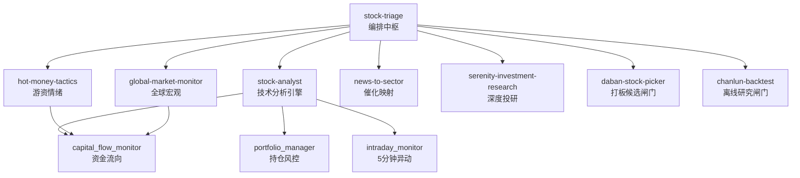

<picture>
  <source media="(prefers-color-scheme: dark)" srcset="https://img.shields.io/badge/A--Stock-Agent_System-1a1a2e?style=for-the-badge">
  
</picture>

[](https://www.python.org/)
[](LICENSE)
[](tests/)
[](scripts/smoke_test.py)

A 股多智能体投研系统。11 个仓内专业 Skill、四维打分引擎、覆盖从全球宏观到持仓风控、打板候选池和离线策略验证的完整决策链路。

**非交易机器人。** 系统只做数据分析和分级建议，不下单、不操盘。

---

## 架构



## 能力矩阵

| 模块 | 功能 | 数据源 |
|------|------|--------|
| **stock-analyst** | 日/周/60分/30分多框架技术分析、板块扫描、条件筛选 | 腾讯、新浪、yfinance |
| **hot-money-tactics** | 涨停板全景、连板梯队、封板质量、情绪周期、板块轮动 | AkShare |
| **daban-stock-picker** | 主板10cm打板候选闸门：首板回封、二板弱转强、六问否决、可成交性 | 结构化行情/板块/持仓 JSON |
| **chanlun-backtest** | 缠论/打板离线研究闸门：IS/OOS、成本、对照组、统计检验 | 本地研究状态 JSON |
| **global-market-monitor** | 美股/VIX/美债/期货/外汇/自然灾害 → A股影响评估 | yfinance、USGS、GDACS |
| **news-to-sector** | 实时资讯→18条产业链映射 + 预期差分析 | SerpAPI |
| **serenity-investment-research** | 深度投研：供应链拆解、财务分析、估值情景、熊市审计 | cninfo、pypdf |
| **four-dim scorer** | S/A/B/C 加权分级：技术(30%)×情绪(25%)×催化(25%)×深度(20%) | 以上全部 |
| **hk-a-linkage** | AH溢价率、恒生背离、港股权重异动 | 腾讯、yfinance |
| **capital-flow-monitor** | 北向资金、主力/散户资金、板块资金 | 东方财富 |
| **portfolio-manager** | 持仓跟踪、止损止盈、回撤止盈、仓位集中度风控 | 腾讯 |
| **intraday-monitor** | 5分钟异动告警：涨跌停、放量、急涨急跌 | 腾讯 |
| **institution-tracker** | 机构调研、券商研报、大股东增减持 | 东方财富 |
| **event-calendar** | 限售解禁、分红除权、政策窗口 | 东方财富 |
| **performance-tracker** | 信号胜率统计、分级表现、反馈闭环 | 腾讯 |

## 快速开始

### 前置条件

需要 **Python 3.10 或更高版本**（macOS 默认 Python 3.9 不可用）。

```bash
# 检查 Python 版本
python3 --version   # 必须是 3.10+
```

### 安装

```bash
git clone https://github.com/Eleven1111/a-stock-agent-system.git
cd a-stock-agent-system

# 创建并激活 Python 3.10+ 虚拟环境
python3.12 -m venv .venv        # 或 python3.10 / python3.11
source .venv/bin/activate

# 安装全部依赖
python -m pip install -e ".[charts,fundamentals,research,dev]"
```

> **macOS 用户**：如果系统 `python3` 仍是 3.9，请通过
> `brew install python@3.12` 安装新版本，然后使用 `python3.12`。

### 验证

```bash
python scripts/smoke_test.py      # 9项集成检查
python -m pytest -q tests/        # 254项测试全部通过
```

### 运行

```bash
# 四维评分
python skills/stock-triage/scripts/four_dim_scorer.py 002156 通富微电 --json

# 全球市场扫描
python skills/global-market-monitor/scripts/monitor.py --summary

# 港A联动
python skills/stock-triage/scripts/hk_a_linkage.py

# 新闻→板块分析
python skills/news-to-sector/scripts/main.py "焦煤期货主力合约触及涨停"

# 持仓风控
python skills/stock-triage/scripts/portfolio_manager.py --check

# 60分钟短线入场判断
python skills/stock-triage/scripts/four_dim_scorer.py 002156 通富微电 --timeframe 60

# 打板候选池
python skills/daban-stock-picker/scripts/daban_candidate_api.py --example --json

# 离线策略研究闸门
python skills/chanlun-backtest/scripts/research_gate.py --example --json
```

### 录入持仓

```bash
python skills/stock-triage/scripts/portfolio_manager.py --add 600011 华能国际 9.10 2000
```

## 配置

```bash
# 可选：重定向运行时数据、缓存和状态（默认 ~/.hermes）
export HERMES_HOME=/path/to/hermes

# 可选：覆盖 BaoStock 备用脚本使用的 Hermes Python
export HERMES_PYTHON=/path/to/python3

# 可选：启用东方财富接口（资金流向、机构数据）
export NO_PROXY=.eastmoney.com,.gtimg.cn,.sinajs.cn

# 可选：启用新闻搜索
export SERPAPI_API_KEY=your_key
```

运行时路径统一通过 `skills/common/paths.py` 解析并支持 `HERMES_HOME`，因此可以在仓库、沙箱或 CI 中运行而不写入部署机 home。系统内置数据源健康追踪。关键数据缺失时（如 yfinance 不可用），输出 `"status": "insufficient_data"` 并拒绝给方向性判断。

## Cron 调度

所有任务定义在 [`cron/hermes-cron-manifest.json`](cron/hermes-cron-manifest.json)。调度依赖外部 [Hermes Agent](https://hermes-agent.nousresearch.com) 运行时——本仓库提供脚本，Hermes 提供时钟。

manifest 中每个定时任务都先进入 `scripts/hermes_job_runner.py`。runner 在隔离子进程中执行真实业务脚本，写入 `$HERMES_HOME/cron/output/{job_id}/{run_id}.json`，并维护 `$HERMES_HOME/cron/output/job_runs.json` 运行账本，再按 `deliver` 配置决定是否推送。例行数据任务可设为 `deliver=local`，避免定时任务输出污染主线对话。

```bash
python scripts/validate_cron_manifest.py cron/hermes-cron-manifest.json
```

部署守卫：

```bash
# 诊断 Gateway cwd/run_agent.py 影子导入和 schedule 状态风险
python scripts/hermes_gateway_doctor.py --write-launcher

# Hermes Gateway cron 不稳定时的应急兜底：
# 生成直接运行 isolated job 的系统 crontab 行。
python scripts/generate_system_crontab.py --repo-dir "$PWD" --hermes-home "$HERMES_HOME"
```

仓库 cron 必须完全自包含。不要部署需要 Gateway 侧 `{template}` 动态注入的任务，否则会重新走 in-process agent cron 路径，重新触发 `run_agent.AIAgent` 导入冲突。

### 动态选股漏斗

定时选股已取消固定代码列表，改为三级动态漏斗：

1. **15:05 候选发现**：读取上交所/深交所官方股票列表，批量获取腾讯全市场行情，完成流动性与可交易性过滤，再用前复权 K 线增强；打板与趋势两套排序器分别评分，平衡生成约 200 只观察池。
2. **09:15–09:25 集合竞价**：次日自动读取观察池，采集腾讯五档快照，打板/趋势通道继续独立保留配额，剔除一字板和缺失数据后收敛为 20 只竞价短名单。
3. **09:35 开盘确认**：结合实时行情和可成交性，在保留双策略通道的前提下最终留下不超过 5 只可执行观察标的。

所有通过基础过滤的候选都写入 `candidate_lifecycle/YYYY-MM-DD.json`，保留阶段历史、淘汰原因和增量 T+1/T+3 结果。完整状态写入 `HERMES_HOME`，cron artifact 只保留压缩摘要，避免污染主线对话。

| 时间 | 任务 | 频率 |
|------|------|------|
| 08:15 | 全球盘前扫描 | 工作日 |
| 09:15–09:24 | 集合竞价快照 | 工作日每分钟 |
| 09:25 | 集合竞价收口+候选池 | 工作日 |
| 09:35 | 开盘确认+上车判定 | 工作日 |
| 09:00–15:00 | 盘中异动告警 | 每5分钟 |
| 09:45, 13:45, 14:45 | 港A联动 | 工作日 |
| 10:30, 14:30 | 资金流向监控 | 工作日 |
| 15:05 | 全市场动态候选发现 | 工作日 |
| 15:18 | 动态前20只四维复核 | 工作日 |
| 15:25 | 持仓风控检查 | 工作日 |
| 15:35 | 收盘Triage→Kanban派发 | 工作日 |
| 22:30 | 全球晚间扫描 | 工作日 |
| 周六 10:00 | 机构行为周报 | 每周 |
| 周日 10:00 | 胜率统计周报 | 每周 |

## 输出格式

每个打分脚本输出结构化 JSON：

```json
{
  "code": "002156",
  "name": "通富微电",
  "confidence": "high",
  "data_coverage": {"realtime": true, "kline": true, "news": true, "valuation": true},
  "weighted": 7.2,
  "grade": "A",
  "emoji": "🟢🟢",
  "advice": "推荐 — 技术面偏多，有催化支撑",
  "scores": {
    "technical": {"score": 7.5, "ma5": 58.3, "rsi6": 55.1, "detail": "MACD金叉; 价格站上MA20"},
    "sentiment": {"score": 6.0, "turnover": 4.2, "detail": "情绪中性"},
    "catalyst": {"score": 8.0, "news_count": 3, "detail": "利好催化: 封测订单饱满..."},
    "deep": {"score": 7.0, "pe": 35.2, "detail": "PE=35.2, 市值=420亿"}
  }
}
```

全球监控输出 `source_health` 并在数据不足时阻止影响评估：

```json
{
  "source_health": {
    "yfinance": {"status": "ok"},
    "serpapi": {"status": "ok"},
    "usgs": {"status": "ok"}
  },
  "impact": {
    "status": "ok",
    "alerts": [...],
    "summary": "利空：AI算力(-3), 半导体(-2)；利好：电力(+1)"
  }
}
```

关键数据缺失时：

```json
{
  "source_health": {"yfinance": {"status": "failed", "error": "yfinance not installed"}},
  "impact": {
    "status": "insufficient_data",
    "alerts": [],
    "summary": "关键市场数据不足：美股指数/VIX/美债不可用，禁止输出方向性A股判断"
  }
}
```

## 项目结构

```
a-stock-agent-system/
├── pyproject.toml              # 依赖管理
├── config/scoring.yaml         # 评分权重 & 风控参数
├── config/candidate_selection.json # 动态股票池与漏斗参数
├── cron/hermes-cron-manifest.json  # 16个隔离定时任务
├── scripts/
│   ├── hermes_job_runner.py    # Cron隔离runner + artifact写入
│   ├── hermes_gateway_doctor.py # 部署机Gateway导入/schedule诊断
│   ├── generate_system_crontab.py # 系统cron兜底生成器
│   ├── smoke_test.py           # 9项集成验证
│   └── validate_cron_manifest.py
├── tests/                      # 254个单元测试
├── skills/
│   ├── common/                 # 共享HTTP/状态 + 候选排序/生命周期
│   ├── stock-triage/           # 编排中枢
│   ├── stock-analyst/          # 技术分析引擎
│   ├── hot-money-tactics/      # 游资战法
│   ├── daban-stock-picker/     # 主板10cm打板候选闸门
│   ├── chanlun-backtest/       # 离线策略研究闸门
│   ├── global-market-monitor/  # 全球宏观→A股影响
│   ├── news-to-sector/         # 产业链催化映射
│   ├── serenity-investment-research/  # 深度投研
│   ├── a-stock-commands/       # Discord快捷指令
│   ├── a-stock-data/           # 数据源参考
│   └── a-stock-daily-report/   # 每日简报模板
└── AGENTS.md                   # 项目宪法
```

## 设计原则

**故障闭合。** 关键数据缺失时输出 `insufficient_data`，绝不猜测。

**置信度先于信念。** 每项分析携带 `confidence` 字段。低置信度时阻止方向性判断。

**脚本优于服务。** 每个模块是独立的 CLI 脚本。无服务器、无数据库、无常驻进程。按需组合。

**状态原子写入。** 所有 JSON 写入通过 `state_store.atomic_write_json()`，带备份和崩溃恢复。

## 数据源

| 源 | 覆盖 | 要求 |
|----|------|------|
| 腾讯 `qt.gtimg.cn` | A股/港股实时行情 + K线 | 无 |
| Yahoo Finance `yfinance` | 美股/全球指数/VIX/期货/汇率 | `pip install yfinance` |
| 东方财富 | 资金流向、机构数据、事件日历 | `NO_PROXY=.eastmoney.com` |
| 新浪 `hq.sinajs.cn` | A股实时行情（备用） | 无 |
| SerpAPI | 全球新闻搜索 | `SERPAPI_API_KEY` |
| USGS | 全球地震监测 | 无 |
| GDACS | 飓风/洪水/火山预警 | 无 |

## 测试

```bash
pip install -e ".[dev]"
python -m pytest -q tests/        # 254项测试
python scripts/smoke_test.py      # 9项集成检查
python scripts/validate_cron_manifest.py
```

## 免责声明

本系统仅供学习研究，**不构成任何投资建议**。所有输出基于公开数据和量化规则，不保证准确性。历史表现不代表未来收益。系统不会自动下单或操作任何交易账户。

## 许可证

MIT
