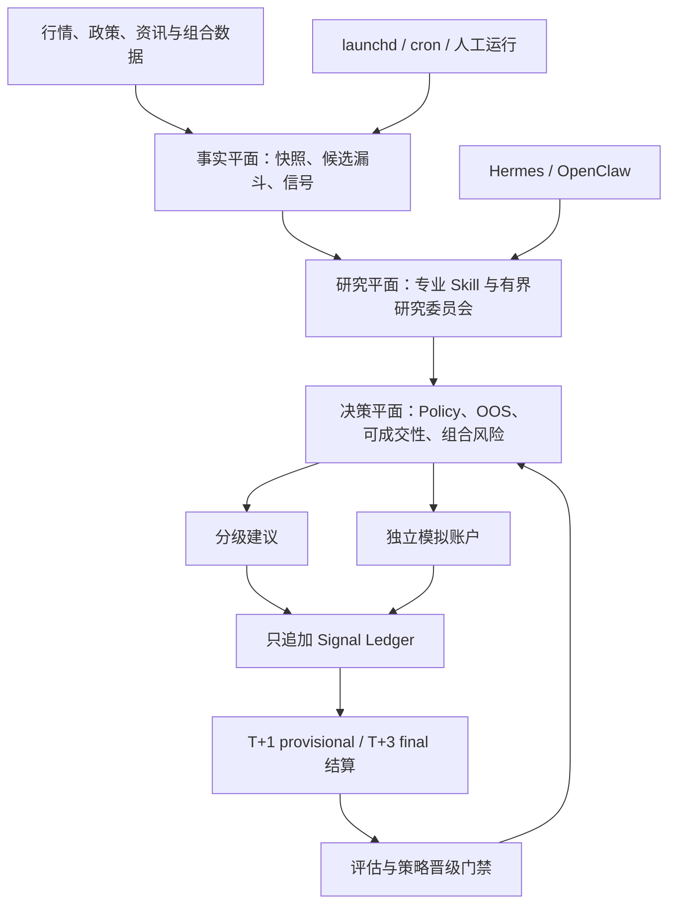

# A 股智能投研 Agent 系统

[English](README.md)

[](https://www.python.org/)
[](https://github.com/Eleven1111/a-stock-agent-system/actions/workflows/ci.yml)
[](LICENSE)

面向中国 A 股市场的 research-first 多智能体决策支持系统。项目把确定性行情管线、
16 个专业 Skill、有界研究 Agent、风险 Policy、只追加 Signal Ledger 和独立模拟账户
组合成一条可审计的投研链路。

> [!IMPORTANT]
> 这不是交易机器人。仓库不连接券商、不发送真实订单，只产出研究 artifact、分级建议和
> 模拟成交。关键证据缺失、过期或无法验证时，系统默认 fail closed。

## 为什么做这个项目

A 股投研最容易出问题的地方，不是单个指标，而是数据采集、解释、风控和事后验证之间的
边界。本项目把这些边界变成可执行契约：

- 行情、政策和资讯输入先成为有版本、可按时点回放的 artifact；
- 候选必须通过流动性、可成交性、评分和组合风险等确定性门禁；
- Agent 可以解释证据，但不能写入事实，也不能自行晋级策略；
- 建议、模拟成交与 T+1/T+3 结果共享同一条可追溯 lineage；
- 研究策略在 OOS、shadow、对账和人工审批全部通过前保持零实盘权重。

## 快速开始

### 环境要求

- Python 3.10 或更高版本
- 文档中的调度器流程面向 macOS 或 Linux
- 实时行情命令需要网络和对应数据源可用

### 安装

```bash
git clone https://github.com/Eleven1111/a-stock-agent-system.git
cd a-stock-agent-system

# 可将 python3.12 替换为任意已安装的 Python 3.10+ 可执行文件。
python3.12 -m venv .venv
source .venv/bin/activate
python -m pip install -c constraints.txt -e ".[charts,fundamentals,auction,dev]"
```

### 验证安装

```bash
python scripts/config_doctor.py
python scripts/validate_cron_manifest.py cron/hermes-cron-manifest.json
```

截至 2026-09-05，仓库 manifest 共登记 **77 个任务，其中 64 个启用**。
这里描述的是 Git 中提交的 manifest，不代表任意一台机器上已经安装的任务状态。

### 运行离线示例

以下命令使用仓库 fixture，不需要券商权限：

```bash
export A_STOCK_STATE_HOME="${TMPDIR:-/tmp}/a-stock-agent-quickstart"
mkdir -p "$A_STOCK_STATE_HOME"

python skills/daban-stock-picker/scripts/daban_candidate_api.py --example --json
python skills/chanlun-backtest/scripts/research_gate.py --example --json
python scripts/evaluate_agent_harness.py --quiet
```

### 运行联网分析

```bash
python skills/stock-triage/scripts/four_dim_scorer.py 600519 贵州茅台 --json
```

评分器只使用当时可用的数据源；关键证据不可用时，会明确列出被排除的维度或返回
`insufficient_data`，不会把数据缺失偷偷换算成中性分。

## 工作原理



系统刻意把工作分成三个平面：

1. **事实平面**：确定性 Adapter 和 DAG 作业生成不可变快照、数据源健康记录、候选和
   Ledger 事件。
2. **研究平面**：专业 Skill 和模型专家解释有界证据；内容寻址文档与时点检索包保留引用、
   访问范围、冲突和来源等级；可选的计划编写角色只能起草白名单分析计划，只有确定性编译器
   能够封装交接产物。Agent 输出是研究，不是事实或可执行订单。
3. **决策平面**：确定性 Policy 统一执行 freshness、可成交性、T+1、集中度、策略注册、
   OOS 和审批门禁。

编译后的研究诊断还必须经过独立的确定性执行门：在隔离子进程中重新验证 handoff、目录、
计划和输入，重复执行两次，并且只以绑定 hash 的 validation evidence 落盘。

DAG 管理的任务进入 `scripts/run_agent_dag.py`，统一执行依赖、快照、租约、Policy 与
Ledger 规则。Manifest 也包含直接调用的维护与研究命令，`scripts/cron_dispatch.py`
按类型化 argv 执行；每个任务的实际入口以当前 manifest 为准。

## 核心能力

| 领域 | 已包含能力 |
|---|---|
| 市场情报 | 多周期技术分析、全球市场、AH 联动、资金流、机构事件、社交关注度 |
| 候选发现 | 动态 A 股股票池、自然语言召回、尾盘异动、涨停与趋势双通道 |
| 评分 | S/A/B/C/D 研究档位；默认技术/情绪/催化/深研权重为 30/15/30/25%；打板与趋势通道使用独立配置 |
| 研究 | Serenity 基本面深研、Chan 结构研究、政策意图解码、多专家研究委员会、受治理的数据写回与混合检索、双 Agent 受限计划编译 |
| 情绪周期 | 每日情绪数据集、滚动分位情绪分、状态分阶段归因、龙头与题材评分 —— 全部 shadow-only |
| 策略研究库 | 六条默认仅供研究的短线假设（超预期、分歧回封、最强助攻、先于龙头、反量龙回头、冰点反转），各带独立闸门评估 |
| 风险与生命周期 | 可成交性、A 股 T+1、集中度、止损止盈、候选 FSM、建议审计、结算、1+1+1 阶梯建仓、四层止损、R 化熔断 |
| 评估 | IS/OOS 隔离、成本与对照组、统计门、shadow 晋级、专家校准、隔离确定性重放、成交约束回测、消融阶梯、尾部风险指标 |
| 运维 | Manifest 调度器、可恢复 DAG、Provider Health、状态恢复、执行 Trace、交付遥测 |
| 模拟 | 10 万元独立模拟账户，遵守 A 股手数、费用、涨跌停、T+1 和 `paper.*` 事件边界 |

能力列表刻意大于实盘决策面。research-only 或纯解释性模块在完成晋级门禁前，不能影响
实盘排序。

六条短线策略默认属于研究假设；没有有效注册和晋级证据时，正向信号降为 `watch`、
实盘仓位倍率归零。验证结果依赖当前状态根中实际积累的样本与门禁，不能从仓库代码
推断某台机器已通过验证，也不能用少量样本宣称胜率。

## 当前实现与验证边界

以下内容按 2026-09-05 的 `main` 核对；包版本为 `1.4.0`，CHANGELOG 仍标为 Unreleased。

| 模块 | 当前实现 | 使用边界 |
|---|---|---|
| 早盘研究链 | 全市场竞价增强观察池、分批行情召回、19:00 大盘深度复盘 | 池外竞价结果仅供研究；复盘聚合已完成产物并披露缺失字段 |
| 行业历史 | 按交易日只追加行业归属变更记录 | 历史从首次实际观测开始，不能倒推此前归属 |
| 板块轮动研究 | 拥挤度、RS/超额动量/RS 斜率/广度、假突破风险、主线/观察/规避三池与多标签 regime | `live_effect=none`；当前归属重建历史为 `exploratory_reconstruction`，不能用于研究晋级 |
| 板块合成分 | 对可得价量分量按原权重重新归一 | 仅覆盖研究方案权重的 41%，缺失 59%；置信度为 low，并非完整 RotationStartScore |
| 四维权重研究 | 每通道 60 个拟合交易日后冻结模型，再积累最早 60 个未见 OOS 交易日 | 只写 shadow 产物，不自动修改生产评分配置 |
| 六策略前向研究 | 统一证据 cohort、规范前向样本冻结、次交易日开盘入场与 T+1/T+3 结算 | 缺失及未解决样本保留在覆盖率分母，研究流水与交易账本隔离 |
| 模拟试运行 | 夜间晋级器满足证据门禁后，每次最多推进一阶至 `manual_pilot` | 仅 `mode=paper_only`，真实 `runtime_allowed=false`；仍要求对账证据，不能晋级真实 live |
| 运维与交付 | 盘前体检、每日诊断归档、分层 trace、默认关闭飞书出口 | manifest 启用不等于机器已部署；无信号静默与数据降级分别处理 |

板块价格、假突破和三池产物带 `validated=false`，尚未完成真实数据验证。
现有 `sector_momentum` 加成仍影响四维情绪面；它与新增的零实盘影响研究因子不同。
参数与缺失项说明见 [评分配置](config/scoring.yaml)，产物及调度见 [运行登记](AUTOPILOT.md)。

## 研究委员会

研究委员会是可回放的有界工作流，不是没有约束的“群聊”：

1. `research-dispatch` 根据 DAG 事实或明确的人工请求确定性入队。
2. `expert_runner.py next` 用带 fencing 的 `claim_id` 认领一个 `(task, role)` 租约。
3. 每个角色只接收不可变、内容寻址的 PIT 证据包。
4. Finding 同时绑定 task、role、claim、输出、工具输入和证据哈希。
5. 冲突只能通过有轮数上限、绑定上一轮 finding 的新证据包升级；adjudicator 只在最终
   合法轮次有效。
6. 确定性合成只产生一个幂等终态 artifact。

非 abstain finding 默认保持 review-only；只有模型可写区之外的
`$A_STOCK_STATE_HOME/approvals/research-committee/` 独立审批校验通过，才可能改变
review 状态。基本面输入使用只追加的 `fundamental_facts_v1` 快照。执行计划编译器必须同时
校验新鲜的市场、组合、质量和策略上下文，以及已绑定的 synthesis 或 proposal approval，
最终仍固定输出 `execution_eligible=false`。

```bash
# 明确发起一次深度辩论
python scripts/research_dispatch.py \
  --kind deep_debate \
  --code 600519 \
  --reason "复核证据链与风险"

# 认领并查看工单
python scripts/expert_runner.py next --worker hermes
python scripts/expert_runner.py status

# 对 ready 任务执行确定性合成
python scripts/expert_runner.py synthesize

# 查看 research-only 的 PIT、执行计划与校准入口
python scripts/fundamentals_snapshot.py --help
python scripts/compile_research_execution_plan.py --help
python scripts/expert_calibration.py --help
```

P3 学习闭环只会从 research consumer 审计产物提出改进候选；人工补齐冻结 benchmark
并审核后，才能导出离线评测集。它不会自动修改提示词、代码、事实层或生产配置：

```bash
python scripts/learning_eval_factory.py scan
python scripts/learning_eval_factory.py status
python scripts/learning_eval_factory.py export --output /tmp/a-stock-learning-eval
python scripts/evaluate_agent_harness.py \
  --cases /tmp/a-stock-learning-eval/cases.json \
  --quiet
```

契约与审核流程见 [Learning Ledger 与 Eval Factory v1](docs/learning-eval-factory-v1.md)。

进一步阅读：[研究委员会使用指南](docs/research-committee-guide.md)和
[运行时契约](skills/research-committee/SKILL.md)。

## 安全模型

仓库明确执行以下边界：

- **不执行真实交易**：不存在券商接入或自动下单路径。
- **默认故障闭合**：关键证据缺失时返回 blocked、`insufficient_data` 或 abstained。
- **只使用时点证据**：影响决策的未来、过期、可变或 lineage 不匹配证据会被拒绝。
- **研究不等于权限**：Agent finding、策略包、Chan 信号、反身性分析和模拟结果都不能
  自我晋级。
- **人工审批必须绑定**：审批同时绑定路径、身份、时间和内容；一个 reviewer 字符串不是审批。
- **风险优先**：证据充分且达到阈值的 `risk_redteam` 否决在委员会合成中保持最高优先级。
- **渠道接受不等于送达**：进程成功、Provider 接受和用户实际收到是三个不同事实，系统不会
  伪造送达回执。

安全问题请阅读 [SECURITY.md](SECURITY.md)。不要在公开 Issue 中提交密钥、持仓、生产状态或
可利用漏洞细节。

## 调度与状态

所有定时任务统一声明在
[`cron/hermes-cron-manifest.json`](cron/hermes-cron-manifest.json)。launchd 可每 60 秒
调用一次 `scripts/cron_dispatch.py`；dispatcher 匹配已启用且到期的任务，按 job/minute
去重，并用类型化 argv、`shell=False` 启动。

运行多 Runtime 工作流前，应显式配置共享状态根：

```bash
export A_STOCK_STATE_HOME="$HOME/.a-stock-agent"
export A_STOCK_STATE_ID="my-a-stock-cluster"
export A_STOCK_RUNTIME="hermes"  # 或 openclaw
```

同一台主机上的 Hermes 与 OpenClaw 必须解析到相同的 `A_STOCK_STATE_HOME` 和
`A_STOCK_STATE_ID`；不一致时 fail closed。多台主机挂载同一状态卷不属于受支持的并发拓扑：
租约和 `fcntl` 锁都是主机本地能力，不能提供分布式排他。运行时状态、密钥、持仓、Ledger 和
私有研究 artifact 不得提交到 Git。

部署、任务对账、启停和回滚说明见 [AUTOPILOT.md](AUTOPILOT.md)。Manifest 是仓库内的任务
定义；机器上实际安装的调度状态必须单独验证。

飞书出口默认关闭：当前 manifest 没有 `feishu_direct` 作业。只有显式配置
`A_STOCK_FEISHU_EGRESS_ENABLED=true` 和相应目标，相关出口才允许调用 `lark-cli`；
仅配置聊天 ID 不会恢复推送。部署核验见 [部署机运维手册](docs/deployment-runbook.md)。

## 配置与数据源

带版本且不含密钥的 Policy 位于 [`config/`](config/)；运行时密钥应放在环境变量或 Runtime
私有环境文件中。

| 环境变量 | 用途 | 是否必需 |
|---|---|---|
| `A_STOCK_STATE_HOME` | 多 Runtime 共用的状态根 | 多 Runtime 与审批流程必需 |
| `A_STOCK_STATE_ID` | 防止误连不同状态集群 | OpenClaw 对账必需 |
| `A_STOCK_RUNTIME` | `hermes`、`openclaw` 或 local 的运行身份 | 推荐 |
| `SERPAPI_API_KEY` | 催化分析所需资讯搜索 | 可选 |
| `EASTMONEY_QGQP_B_ID` | 东方财富自然语言选股召回 | 可选 |
| `WENCAI_API_KEY` | 同花顺问财召回增强 | 可选 |
| `TAVILY_API_KEYS` | Serenity Web Search Provider | 可选 |
| `BOCHA_API_KEYS` | Serenity Web Search 降级源 | 可选 |
| `SEARXNG_BASE_URLS` | 自建搜索降级源 | 可选 |

数据源可用性通过 source-health artifact 和 `scripts/provider_doctor.py` 显式记录。可选 Provider
缺失时，只关闭或重新归一化自身维度，不会静默编造数据。

## 验证

提交 Pull Request 前运行以下核心检查：

```bash
pytest -q
python -m ruff check .
python scripts/validate_cron_manifest.py cron/hermes-cron-manifest.json
python -m compileall -q skills scripts tests
python scripts/check_maintainability_budget.py --base-ref origin/main
git diff --check
```

CI 覆盖受支持的 Python 矩阵和 CodeQL。固定 Agent Harness 只验证证据纪律与权限边界，不证明
投资收益或开放世界预测准确率。

## 文档

| 主题 | 文档 |
|---|---|
| Runtime 架构与加固 | [docs/architecture-hardening.md](docs/architecture-hardening.md) |
| 交易生命周期与结算 | [docs/trading-lifecycle.md](docs/trading-lifecycle.md) |
| 组合研究协议 | [docs/portfolio-research-protocol.md](docs/portfolio-research-protocol.md) |
| 模拟交易 | [docs/paper-trading-protocol.md](docs/paper-trading-protocol.md) |
| 研究委员会 | [docs/research-committee-guide.md](docs/research-committee-guide.md) |
| Stock Intelligence 集成 | [docs/stock-intelligence-integration.md](docs/stock-intelligence-integration.md) |
| 已安装调度器 | [AUTOPILOT.md](AUTOPILOT.md) |
| auction-data-provider | [docs/auction-data-provider.md](docs/auction-data-provider.md) |
| dataset-contract-v1 | [docs/dataset-contract-v1.md](docs/dataset-contract-v1.md) |
| analysis-plan-v1 | [docs/analysis-plan-v1.md](docs/analysis-plan-v1.md) |
| learning-eval-factory-v1 | [docs/learning-eval-factory-v1.md](docs/learning-eval-factory-v1.md) |
| deployment-runbook | [docs/deployment-runbook.md](docs/deployment-runbook.md) |
| falsified-approaches | [docs/falsified-approaches.md](docs/falsified-approaches.md) |
| 版本历史 | [CHANGELOG.md](CHANGELOG.md) |

## 仓库结构

```text
a-stock-agent-system/
├── config/                      # 有版本的评分、风控与研究 Policy
├── cron/                        # 跨 Runtime 作业 Manifest
├── docs/                        # 架构与运行协议
├── evals/                       # 固定 Agent 与策略评测
├── scripts/                     # 调度器、DAG、Doctor、报告与 CLI
├── skills/                      # 16 个专业 Skill 与共享 Runtime 代码
├── tests/                       # 单元、集成与契约测试
├── AGENTS.md                    # 仓库运行契约
├── AUTOPILOT.md                 # 已安装调度器操作说明
└── pyproject.toml               # Python 包与依赖元数据
```

## 参与贡献

提交 Pull Request 前请阅读 [CONTRIBUTING.md](CONTRIBUTING.md)。所有改动必须保留 fail-closed
决策契约；行为变化需要回归测试；运行时状态和密钥不得进入 Git。

## 免责声明

本项目仅供研究与学习，不构成投资建议，也不保证信息的准确性、完整性、及时性或收益。
使用者应独立判断并自行承担风险。

## 许可证

[MIT](LICENSE)
