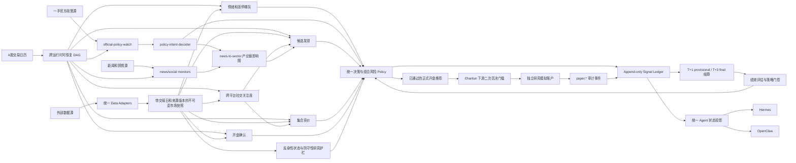

<picture>
  <source media="(prefers-color-scheme: dark)" srcset="https://img.shields.io/badge/A--Stock-Agent_System-1a1a2e?style=for-the-badge">
  
</picture>

[](https://www.python.org/)
[](LICENSE)
[](https://github.com/Eleven1111/a-stock-agent-system/actions/workflows/ci.yml)
[](scripts/smoke_test.py)

> Smoke 徽章反映最近一次联网验证结果。离线运行时 `global_monitor` 或 `hk_a_linkage`
> 可能仍会超时，因为它们依赖实时行情数据。

A 股多智能体投研系统。15 个仓内专业 Skill、四维打分引擎、覆盖从全球宏观到持仓风控、打板候选池、政策意图解码和离线策略验证的完整决策链路。

**非交易机器人。** 系统只做数据分析和分级建议，不向券商发送订单、不操盘。仓内的
模拟交易账户只用于研究数据积累，与真实持仓完全隔离。

---

## 架构



## 能力矩阵

| 模块 | 功能 | 数据源 |
|------|------|--------|
| **stock-analyst** | 日/周/60分/30分多框架技术分析、板块扫描、条件筛选 | 腾讯、新浪、yfinance |
| **hot-money-tactics** | 涨停板全景、连板梯队、封板质量、情绪周期、板块轮动 | AkShare |
| **eod-anomaly-scanner** | 全A尾盘(14:30-15:00)量比+涨幅异动扫描，估值/60日位置过滤；次日开盘 `--confirm` 模式对比跳空 | 腾讯、AkShare |
| **social-sentiment** | 东方财富人气/飙升榜 + 雪球讨论/关注榜；跨源互证、变化速率与拥挤度背离 | 东方财富、雪球，可选百度 |
| **daban-stock-picker** | 主板10cm打板候选闸门：首板回封、二板弱转强、六问否决、可成交性。阈值与回测引擎共用同一份配置源 | `config/daban_thresholds.yaml`、结构化行情/板块/持仓 JSON |
| **chanlun-backtest** | 离线研究闸门（IS/OOS、成本、对照组、统计检验）**+** `chan_structure` 信号生成器：分型→笔→中枢→三买三卖→MACD背驰。信号只有过闸后才获得实盘权重 | 腾讯前复权K线、本地研究状态 JSON |
| **global-market-monitor** | 美股/VIX/美债/期货/外汇/自然灾害 → A股板块方向与个股观察映射 | yfinance、USGS、GDACS |
| **policy-intent-decoder** | 官方政策来源位阶、真实意图、传导链、受益/承压方向和选股辅助维度 | 政府/官媒官方来源 |
| **news-to-sector** | 实时资讯→18条产业链映射 + 预期差分析 | SerpAPI |
| **serenity-investment-research** | 深度投研：供应链拆解、财务分析、估值情景、熊市审计。五种请求路由模式（主题扫描/单公司挑战/候选对比/研究伙伴对话/学习模式）；主题扫描先给产业链层级排序再给公司排序，每个最终候选要回答五问；深度报告需过 `report_lint.py` 硬闸（≥3个价值链层级、候选宇宙≥20家、证据台账≥25条来源、必含"被降级的热门方向"章节）。加权评分卡通过带新鲜度衰减的缓存回流四维评分的深度维度 | cninfo、pypdf、`web_search.py` |
| **research-committee** | 多专家研究平面：一组专家（见 `skills/research-committee/experts/`）在结论进入证据层之前先做交叉质询辩论，由 `skills/research-committee/SKILL.md` 编排 | 内部，消费其他 Skill 的证据 |
| **four-dim scorer** | S/A/B/C 加权分级：技术(30%)×情绪(15%)×催化(30%)×深度(25%)。深度维度由 Serenity 驱动（非简单PE分桶）；技术维度纳入已过闸的缠论结构信号 | 以上全部 |
| **hk-a-linkage** | AH溢价率、恒生背离、港股权重异动 | 腾讯、yfinance |
| **capital-flow-monitor** | 北向资金、主力/散户资金、板块资金 | 东方财富 |
| **portfolio-manager** | 分批持仓、A股T+1约束、止损止盈、回撤止盈、打板车道时间止损、止盈目标提醒、仓位集中度风控 | 腾讯 |
| **intraday-monitor** | 持仓+动态订阅异动告警；清仓和取消后自动退订 | 腾讯 |
| **institution-tracker** | 机构调研、券商研报、大股东增减持 | 东方财富 |
| **event-calendar** | 限售解禁、分红除权、政策窗口 | 东方财富 |
| **performance-tracker** | 信号胜率统计、分级表现、反馈闭环 | 腾讯 |
| **discipline-review** | 每日买入建议与实际成交对比（追价/超仓位/未跟单）、尚未处理的持仓纪律信号、账户熔断状态 | 腾讯 |
| **反身性防守护栏** | 基于当时可见快照识别龙头孤立、疑似算法化虚假共识和机构派发风险；只允许禁止新增、禁止追入或降低仓位，不提供正向准入、不加分、不绕过策略注册，并用成本后消融报告验证 | `config/reflexivity_strategy.json`、候选生命周期与统一账本 |
| **paper-trading** | 10万元独立研究模拟账户。只消费已通过推荐与开盘确认的标的，再由 Chanlun 看多结构作下游二次否决门槛；Chanlun 不选股、不排序、不加分。复用 A 股 T+1、涨跌停、费用、滑点、止损止盈和集中度纪律，只记录 `paper.*` 事件，绝不发送真实订单 | `config/paper_trading.json`、开盘推荐、Chanlun 结构信号、统一账本 |
| **nl-screening 召回通道** | 自然语言选股，作为候选发现的第二召回通道：东方财富智能选股（免费，依赖 `EASTMONEY_QGQP_B_ID`；未配置时明确报告为 disabled）+ 同花顺问财 OpenAPI 可选增强（`WENCAI_API_KEY`）。候选带 `recall_source` 标记，仍需经过与收盘发现漏斗相同的候选 FSM/policy 闸门，不绕过任何一道 | 东方财富智能选股、同花顺问财 |
| **互动易/上证e互动证据** | 深市互动易（fail-closed）+ 沪市上证e互动（best-effort，可能降级为 `sse_unavailable`）投资者问答，接入候选/持仓证据包"投资者关注热点"维度 | 互动易、上证e互动 |
| **NewsNow 聚合热点源** | 低位阶关注度线索（S1/S2，非权威证据），默认5个源：财联社热门、雪球热门股票、华尔街见闻快讯、金十数据、格隆汇事件；可自建实例替换默认公共实例；L1 规则引擎仍需命中关键词才放行 | NewsNow（公共demo或自建，`NEWSNOW_BASE_URL`） |
| **策略包解释层（声明式）** | 内置 `dragon_head`（龙头策略）、`emotion_cycle`（情绪周期）两个按市场 regime 过滤的解释性策略包，输出证据包中的 `strategy_pack_hints`。纯解释性：`influences_live_ranking=false`，升级实盘权重需过 `research_gate` 样本外验证 | `config/strategy_packs/*.yaml` |
| **情绪周期确定性特征** | 5个确定性、fail-closed 技术特征（成交量60日时序分位、单日爆量≥5x出货嫌疑标记、均线粘合度、ATR波动收缩分位、顶底多条件合成判定）；`emotion_cycle:v1` 未注册进 `strategy_registry` 前默认0权重 | 腾讯前复权K线 |
| **web-search 适配层** | 多供应商降级链（Tavily → 博查 → SearXNG），单 key 401/402/429 自动轮换到下一个 key；Serenity 研究 Harvest Sources 环节用它替代会话内浏览 | Tavily、博查、SearXNG |
| **推荐反馈闭环** | `scripts/recommendation_feedback.py` 按信号 id 记录 `useful`/`not_useful`；建议动作与最终动作背离时携带结构化机器可读理由码，由 `recommendation_audit.py --audit-violations` 审计；反馈统计进入 `score_calibration_report.py` | `signal_ledger.jsonl` |

## 政策意图在系统里的位置

`policy-intent-decoder` 位于**资讯入口层和选股证据层之间**，不是新的交易策略，也不是新的持仓来源。它把公开官方政策信号转成结构化证据，供 `news-to-sector`、`stock-triage` 和四维评分里的催化维度引用。

它解决的是两个问题：

1. **政策是不是一手有效信号**：先看来源位阶、发布主体、文件类型、是否多部门协同、是否出现财政/货币/监管/产业等硬工具，而不是先看市场传闻。
2. **信号怎样传到股票池**：把政策目标、执行工具、约束条件、受益/承压产业链、传导时滞和需要验证的市场反应拆开，避免把“政策表态”直接等同于“可买股票”。

政策信号只增加选股维度，不跳过任何交易闸门。候选仍必须通过行情、流动性、可交易性、公告质检、组合风险和研究门控；未通过 OOS 或证据门控的策略不会因为政策热度进入实盘排序。

## 资讯与政策信号回路

```text
一手官方源
  -> official-policy-watch 每10分钟轮询、去重、 freshness gate
  -> policy-intent-decoder 输出 policy_intent_signal_v1
  -> news-to-sector 映射产业链、预期差、受益/承压方向
  -> stock-triage / four-dim scorer 作为催化和上下文证据
  -> unified policy / signal ledger / performance tracker
  -> 后续表现反哺策略门控和权重校准
```

官方政策源由
[`skills/policy-intent-decoder/references/official-policy-sources.json`](skills/policy-intent-decoder/references/official-policy-sources.json)
维护，包括国务院政策库、国务院要闻、新华社、证监会、央行、发改委、财政部、工信部、金融监管总局、上交所和深交所等一手公开入口。`official-policy-watch` 在北京时间 08:00-22:00 按日历日每 10 分钟运行一次，不依赖交易日开市；只有新鲜、未见过、且命中政策工具/产业传导特征的条目才提升为待解读信号。

`news-to-sector` 遇到政策类资讯时，先调用政策解码逻辑确认官方意图，再做产业链映射。券商观点、社交媒体、市场涨跌和新闻转载只作为**反应层证据**，不能替代官方来源来判断政策意图。

## L2 资讯自动挂载候选证据包

`news_pipeline.read_graded_news(code=, sectors=, days=, limit=)` 按股票代码或所属板块查询已评级资讯，`evidence_pack.py` 为候选/持仓证据包新增 `news_evidence` 段（fail-open，状态显式为 `ok`/`empty`/`unavailable`，不会静默留空）。资讯评级模型自行判断某条新闻是否点名了具体股票代码（`affected_codes` 字段），目前没有自动化校验这个判断是否忠实于原文；对高置信度候选使用该证据时，应交叉核对资讯原文，不要无条件信任 `affected_codes`。

## 第二召回通道：自然语言选股

`skills/common/nl_screening.py` 在收盘价/流动性漏斗之外，为候选发现新增第二召回通道：东方财富免费智能选股（依赖 `EASTMONEY_QGQP_B_ID`；cookie 未配置时该通道明确报告为 `disabled` 并说明原因）+ 同花顺问财 OpenAPI 可选增强（`WENCAI_API_KEY`）。这条通道产出的候选带 `recall_source` 标记，但仍需经过与收盘发现漏斗相同的候选 FSM 和 policy 闸门——不绕过任何一道。筛选条件模板（通用，无具体股票/板块）位于
[`config/nl_screening.yaml`](config/nl_screening.yaml)。

## 快速开始

### 前置条件

需要 **Python 3.10 或更高版本**（macOS 默认 Python 3.9 不可用）。

```bash
# 检查 Python 版本
python3 --version   # 必须是 3.10+
```

### 安装

```bash
git clone https://github.com/Eleven1111/a-stock-agent-system.git
cd a-stock-agent-system

# 创建并激活 Python 3.10+ 虚拟环境
python3.12 -m venv .venv        # 或 python3.10 / python3.11
source .venv/bin/activate

# 安装全部依赖
python -m pip install -e ".[charts,fundamentals,research,dev]"
```

> **macOS 用户**：如果系统 `python3` 仍是 3.9，请通过
> `brew install python@3.12` 安装新版本，然后使用 `python3.12`。

### 验证

```bash
python scripts/smoke_test.py      # 13项集成检查
python -m pytest -q tests/        # 全量回归测试
```

### Hermes / OpenClaw 共享状态

两端设置相同的状态目录，确保持仓、推荐和监控订阅一致：

```bash
export A_STOCK_STATE_HOME="$HOME/.a-stock-agent"
export A_STOCK_BACKUP_HOME="$HOME/.a-stock-agent-backups"
# 多运行时或多机器部署建议固定该身份值
export A_STOCK_STATE_ID="my-a-stock-cluster"
```

OpenClaw 未显式设置 `A_STOCK_STATE_HOME`，或固定的 `A_STOCK_STATE_ID` 不匹配时，
任务会 fail-closed。关键账户 JSON 在实时状态目录之外保存有限版本快照，缓存文件不备份。

新闻密钥放在独立 env 文件时，生成 OpenClaw cron 需同时传
`--env-file /secure/a-stock.env`。调度器只传文件路径，不把密钥写入 cron 命令。

T+1 约束、推荐质检和动态订阅规则见
[A股交易与监控生命周期](docs/trading-lifecycle.md)。
反身性防守研究与模拟账户的详细边界分别见
[游资主线龙头选股协议](docs/hot-money-selection-protocol.md)和
[推荐后 Chanlun 门控模拟交易协议](docs/paper-trading-protocol.md)。

两端使用相同执行入口：

```bash
python scripts/run_agent_dag.py global-preopen --runtime hermes
python scripts/run_agent_dag.py global-preopen --runtime openclaw
python scripts/agent_runtime_context.py
```

如果 Hermes 与 OpenClaw 位于两台机器，`A_STOCK_STATE_HOME` 必须指向同一个共享挂载卷；
仅设置相同的路径字符串无法共享账本，也无法让运行租约互斥。

东方财富请求也共用跨机器限速和熔断状态。共享卷必须支持原子创建目录和同文件系统重命名。
解禁、两融或股东户数缺失/过期时，个股建议自动降为关注；短暂刷新失败只允许回退到仍在
有效期内的最近可信快照。详见
[东方财富数据源鲁棒性](docs/eastmoney-resilience.md)。

### 运行

```bash
# 四维评分
python skills/stock-triage/scripts/four_dim_scorer.py 600519 贵州茅台 --json

# 全球市场扫描
python skills/global-market-monitor/scripts/monitor.py --summary

# 港A联动
python skills/stock-triage/scripts/hk_a_linkage.py

# 新闻→板块分析
python skills/news-to-sector/scripts/main.py "焦煤期货主力合约触及涨停"

# 持仓风控
python skills/stock-triage/scripts/portfolio_manager.py --check

# 60分钟短线入场判断
python skills/stock-triage/scripts/four_dim_scorer.py 600519 贵州茅台 --timeframe 60

# 打板候选池
python skills/daban-stock-picker/scripts/daban_candidate_api.py --example --json

# 离线策略研究闸门
python skills/chanlun-backtest/scripts/research_gate.py --example --json

# 反身性防守护栏：成本后消融研究报告
python scripts/reflexivity_report.py --outcome t3_close_ret --round-trip-cost-bps 20

# 独立模拟账户：推荐/开盘确认先通过，Chanlun 只作下游二次否决门槛
python skills/paper-trading/scripts/paper_trading_runner.py --phase open --json
python skills/paper-trading/scripts/paper_trading_runner.py --phase monitor --json
python skills/paper-trading/scripts/paper_trading_runner.py --phase close --json
python scripts/paper_trading_report.py

# 组合级无前视回放（必须使用当时落盘的历史候选快照）
python scripts/build_portfolio_research_input.py \
  --market-data portfolio_outcome_bars.json \
  --rules-locked-at 2026-06-21T09:34:00+08:00 \
  --output portfolio_backtest_input.json
python skills/chanlun-backtest/scripts/portfolio_backtest.py \
  --input portfolio_backtest_input.json --split 2025-01-01 \
  --artifact portfolio_backtest_oos.json --json
```

### 录入持仓

```bash
python skills/stock-triage/scripts/portfolio_manager.py --add 600519 贵州茅台 150.00 100
```

## 配置

```bash
# 可选：重定向运行时数据、缓存和状态（默认 ~/.hermes）
export HERMES_HOME=/path/to/hermes

# 可选：覆盖 BaoStock 备用脚本使用的 Hermes Python
export HERMES_PYTHON=/path/to/python3

# 可选：启用东方财富接口（资金流向、机构数据）
export NO_PROXY=.eastmoney.com,.gtimg.cn,.sinajs.cn

# 可选：启用新闻搜索
export SERPAPI_API_KEY=your_key

# 可选：启用自然语言选股召回通道
export EASTMONEY_QGQP_B_ID=your_eastmoney_cookie_b_id
export WENCAI_API_KEY=your_ths_iwencai_key

# 可选：将 NewsNow 指向自建实例，而非默认公共demo
export NEWSNOW_BASE_URL=https://your-newsnow-instance

# 可选：web-search 降级链（逗号分隔支持多 key 轮换）
export TAVILY_API_KEYS=key1,key2
export BOCHA_API_KEYS=key1,key2
export SEARXNG_BASE_URLS=https://searxng1.example.com,https://searxng2.example.com
```

运行时路径统一通过 `skills/common/paths.py` 解析并支持 `HERMES_HOME`，因此可以在仓库、沙箱或 CI 中运行而不写入部署机 home。系统内置数据源健康追踪。关键数据缺失时（如 yfinance 不可用），输出 `"status": "insufficient_data"` 并拒绝给方向性判断。

## Cron 调度

所有任务定义在 [`cron/hermes-cron-manifest.json`](cron/hermes-cron-manifest.json)。
文件名为历史兼容命名，manifest 实际由 Hermes、OpenClaw、system cron 和本地运行共用。

每个定时任务都先进入 `scripts/run_agent_dag.py`。DAG 复用成功依赖、重跑计划目标，
并在原子运行租约下调用 `agent_job_runner.py` 执行真实业务脚本。runner 写入
`$A_STOCK_STATE_HOME/cron/output/{job_id}/{run_id}.json`，为 JSON 输出创建不可变
市场快照，并维护 `job_runs.json`。D0/D1 节点还会先固化原始输入，再从快照读回后进行
排名或策略判断。例行任务可设为 `deliver=local`，
避免定时任务输出污染主线对话。

artifact v2 还包含 `trading_date`、`batch_id`、`dependency_gate` 和交易日门禁结果。
非交易日记录为静默跳过，日历未覆盖则 fail-closed；必需上游缺失、失败、过期或交易日
不匹配时，runner 写入 `status=blocked` 并拒绝启动业务脚本。推荐、成交、
监控、T+1 provisional 和 T+3 final 结算统一写入 `signal_ledger.jsonl`；
`agent_state_projector.py` 向两端提供同一份当前状态。详细契约见
[`docs/architecture-hardening.md`](docs/architecture-hardening.md)。

研究模拟账户也由同一 DAG 调度，但使用独立账户投影和 `paper.*` 事件命名空间：09:37
只消费已通过的正式开盘推荐，盘中错峰执行纪律检查，15:25 记录收盘净值。它不连接
券商，也不会把模拟持仓投影成真实持仓。

```bash
python scripts/validate_cron_manifest.py cron/hermes-cron-manifest.json
```

部署守卫：

```bash
# 诊断 Gateway cwd/run_agent.py 影子导入和 schedule 状态风险
python scripts/hermes_gateway_doctor.py --write-launcher

# 配置、数据源与关键状态恢复检查
python scripts/config_doctor.py
python scripts/provider_doctor.py --json
python scripts/state_doctor.py --runtime openclaw --recover

# 生成 OpenClaw command cron；直接运行 DAG，不启动模型 isolated turn
python scripts/generate_openclaw_cron.py \
  --state-home "$A_STOCK_STATE_HOME" \
  --state-id "$A_STOCK_STATE_ID"

# 推荐：读取 OpenClaw 当前任务并按名称对账；已有任务 edit，新任务 create。
# 去掉 --apply 可先审阅将要执行的命令。
python scripts/generate_openclaw_cron.py \
  --state-home "$A_STOCK_STATE_HOME" \
  --state-id "$A_STOCK_STATE_ID" \
  --env-file "$A_STOCK_ENV_FILE" \
  --reconcile --apply
python scripts/cron_budget_report.py

# Hermes Gateway cron 不稳定时的应急兜底：
# 生成直接运行 isolated job 的系统 crontab 行。
python scripts/generate_system_crontab.py --repo-dir "$PWD" --hermes-home "$HERMES_HOME"
```

仓库 cron 必须完全自包含。不要部署需要 Gateway 侧 `{template}` 动态注入的任务，否则会重新走 in-process agent cron 路径，重新触发 `run_agent.AIAgent` 导入冲突。

### 动态选股漏斗

定时选股已取消固定代码列表，改为六级动态漏斗：

1. **15:02 游资上下文**：缓存当日涨停梯队、板块集群和梯队日期。消费端拒绝缺失、未来或过期缓存，避免历史梯队污染新一轮选股。
2. **15:07 候选发现**：读取上交所/深交所官方股票列表，批量获取腾讯全市场行情，完成流动性与可交易性过滤，再用前复权 K 线增强；同一不可变输入同时计算市场广度、主线板块前二和板块内龙头。择时或板块证据不足时只关闭打板通道，趋势通道继续运行。
3. **09:15–09:25 集合竞价**：09:15-09:23 对 500 只深度观察池采集分钟级腾讯五档；09:24 对全部合格股票补一张轻量竞价快照。全市场池外异动只进入研究简报，打板/趋势通道仍经门禁收敛为配置指定的竞价短名单。
4. **09:35 开盘确认**：结合实时行情、公告质检和可成交性留下不超过 5 只策略门禁后的观察标的；报告明确展示市场时点、板块排名、龙头排名、研究态/实盘态和 T+1 约束。
5. **09:50 承接确认**：只复用 09:35 前五候选，单次有界行情刷新验证开盘承接。
6. **13:15 午后回流**：再次验证主线回流和板块内相对强度；两个检查点都只更新研究状态，不下单、不建议当日卖出。

09:37 的模拟账户开仓位于选股漏斗下游：它只消费已通过推荐和开盘确认的标的，再以
Chanlun 看多结构作二次否决；它不新增候选、不改变排序或推荐分，也不发送真实订单。

08:50、09:27、09:36 分别推送早盘、集合竞价、开盘情报；被过滤高分票会附带不可成交、数据不足或门禁原因，但不会因此进入执行链路。

所有通过基础过滤的候选都写入 `candidate_lifecycle/YYYY-MM-DD.json`，保留阶段历史、淘汰原因和增量 T+1/T+3 结果。完整状态写入 `HERMES_HOME`，cron artifact 只保留压缩摘要，避免污染主线对话。

| 时间 | 任务 | 频率 |
|------|------|------|
| 08:15 | 全球盘前扫描 | 工作日 |
| 08:50 | 早盘情报简报 | 工作日 |
| 09:15–09:24 | 集合竞价快照 | 工作日每分钟 |
| 09:26 / 09:27 | 集合竞价收口 / 情报简报 | 工作日 |
| 09:35 | 开盘确认+上车判定 | 工作日 |
| 09:36 | 开盘情报摘要 | 工作日 |
| 09:37 | 模拟账户开仓（推荐与开盘确认通过后，Chanlun 二次否决） | 工作日 |
| 09:50 | 主线龙头承接确认 | 工作日 |
| 13:15 | 主线龙头午后回流确认 | 工作日 |
| 09:00–15:00 | 盘中异动告警 | 每5分钟 |
| 10:08–11:53, 13:08–14:53 | 模拟持仓纪律检查 | 错峰每15分钟 |
| 08:00–22:00 | 官方政策源快扫 | 每10分钟，日历日 |
| 09:25–11:30, 13:00–14:55 | 盘中资讯快扫 | 错峰每5分钟；超过SLA只归档不推方向信号 |
| 09:45, 13:45, 14:45 | 港A联动 | 工作日 |
| 10:30, 14:30 | 资金流向监控 | 工作日 |
| 15:02 | 缓存涨停梯队和市场温度上下文 | 工作日 |
| 15:07 | 全市场动态候选发现 | 工作日 |
| 15:18 | 动态前20只四维复核 | 工作日 |
| 15:25 | 持仓风控检查 + 模拟账户收盘净值 | 工作日 |
| 15:35 | 收盘Triage→Kanban派发 | 工作日 |
| 16:10 | T+1/T+3 信号结算 | 工作日 |
| 09:40, 15:40, 16:40 | 统一 Agent 状态投影 | 工作日 |
| 22:30 | 全球晚间扫描 | 工作日 |
| 周六 10:00 | 机构行为周报 | 每周 |
| 周日 10:00 | 胜率统计周报 | 每周 |

## 待办：Hermes / OpenClaw 后续跟进项

以下是留给 Hermes / OpenClaw 当值模型的常设跟进项。每条都写明触发条件和要跑的具体动作，当值模型不需要额外上下文即可照做。

1. **激活自然语言选股召回通道。** 若用户提供了东方财富 cookie，设置 `EASTMONEY_QGQP_B_ID` 后该通道自动生效；否则保持 disabled，不需要额外操作。若用户提供同花顺问财 key，设置 `WENCAI_API_KEY` 可选启用。
2. **情绪周期特征过闸评估。** `emotion_cycle:v1` 目前 0 权重、纯展示。当积累了足够的历史 `emotion_cycle` 特征输出和 T+1/T+3 结算数据后，应按 `skills/chanlun-backtest/scripts/research_gate.py` 的样本外验证流程（IS/OOS wall、对照组、统计检验）跑一次评估。**OOS 只能跑一次**——跑前必须锁定规则，不得看结果后回头改阈值。通过后用 `--register` 写入 `strategy_registry`，该特征才能获得非零权重。
3. **搜索供应商上线前 smoke test。** `web_search.py` 三个 provider（Tavily/博查/SearXNG）字段解析基于官方文档实现，单测全部用 fixture，未经真实 API 验证。在把它接入任何定时任务前，应先用真实配置的 key 手动跑一次 `python skills/common/web_search.py "<真实查询>" --json`，确认三个 provider 都能返回预期结构。
4. **NewsNow 公共实例的生产可靠性。** 默认公共实例 `newsnow.busiyi.world` 无可用性和限流保证。如果依赖 NewsNow 源做常态化情报采集，应自建 NewsNow 实例（上游项目：`https://github.com/ourongxing/newsnow`）并设置 `NEWSNOW_BASE_URL` 指向自建地址。
5. **旧版 serenity 深度报告的 lint 重跑。** serenity 方法论升级后，`report_lint.py` 对产业链类深度报告新增了硬性阈值（来源数 ≥25、必须有"被降级的热门方向"章节等）。历史报告若需重新引用或作为缓存刷新的基线，重新跑 lint 时可能会因为不满足新标准而失败——这是有意的质量升级，不是回归；发现失败时应重新做一轮研究补齐来源，而不是放宽阈值。
6. **L2 资讯 `affected_codes` 质量核验。** 资讯评级模型自行判断某条新闻是否点名了具体股票代码（`affected_codes` 字段），目前没有自动化校验这个判断是否忠实于原文。当值模型在使用 `news_evidence` 证据时，应对高置信度候选交叉核对一下资讯原文，不要无条件信任 `affected_codes` 字段。

## 输出格式

每个打分脚本输出结构化 JSON：

```json
{
  "code": "600519",
  "name": "贵州茅台",
  "confidence": "high",
  "data_coverage": {"realtime": true, "kline": true, "news": true, "valuation": true},
  "weighted": 7.2,
  "grade": "A",
  "emoji": "🟢🟢",
  "advice": "推荐 — 技术面偏多，有催化支撑",
  "scores": {
    "technical": {"score": 7.5, "ma5": 58.3, "rsi6": 55.1, "detail": "MACD金叉; 价格站上MA20"},
    "sentiment": {"score": 6.0, "turnover": 4.2, "detail": "情绪中性"},
    "catalyst": {"score": 8.0, "news_count": 3, "detail": "利好催化: 封测订单饱满..."},
    "deep": {"score": 7.0, "pe": 35.2, "detail": "PE=35.2, 市值=420亿"}
  }
}
```

全球监控输出 `source_health` 并在数据不足时阻止影响评估：

```json
{
  "source_health": {
    "yfinance": {"status": "ok"},
    "serpapi": {"status": "ok"},
    "usgs": {"status": "ok"}
  },
  "impact": {
    "status": "ok",
    "alerts": [...],
    "summary": "利空：AI算力(-3), 半导体(-2)；利好：电力(+1)"
  }
}
```

关键数据缺失时：

```json
{
  "source_health": {"yfinance": {"status": "failed", "error": "yfinance not installed"}},
  "impact": {
    "status": "insufficient_data",
    "alerts": [],
    "summary": "关键市场数据不足：美股指数/VIX/美债不可用，禁止输出方向性A股判断"
  }
}
```

## 项目结构

```
a-stock-agent-system/
├── pyproject.toml              # 依赖管理
├── config/scoring.yaml         # 评分权重 & 风控参数
├── config/candidate_selection.json # 动态股票池与漏斗参数
├── config/nl_screening.yaml     # 自然语言选股条件模板（通用，无具体股票/板块）
├── config/web_search.json      # web-search 供应商顺序/超时/max_results（不含密钥）
├── config/reflexivity_strategy.json # 反身性防守护栏版本、阈值与配置指纹
├── config/paper_trading.json   # 10万元模拟账户、Chanlun门槛与成交纪律
├── config/strategy_packs/       # dragon_head.yaml、emotion_cycle.yaml（纯解释性）
├── cron/hermes-cron-manifest.json  # 47个跨运行时隔离任务
├── scripts/
│   ├── agent_job_runner.py     # Hermes/OpenClaw共用任务入口
│   ├── run_agent_dag.py        # 依赖排序、重试、断点续跑
│   ├── agent_state_projector.py # 账本到Agent当前状态投影
│   ├── agent_runtime_context.py # Agent推理前强制刷新统一状态
│   ├── hermes_job_runner.py    # 兼容保留的runner实现
│   ├── hermes_gateway_doctor.py # 部署机Gateway导入/schedule诊断
│   ├── generate_system_crontab.py # 系统cron兜底生成器
│   ├── recommendation_feedback.py # useful/not_useful 反馈CLI，反哺 calibration report
│   ├── reflexivity_report.py  # 防守性反身性护栏的成本后消融报告
│   ├── paper_trading_report.py # 模拟账户门控、成交与净值研究报告
│   ├── smoke_test.py           # 13项集成验证
│   └── validate_cron_manifest.py
├── tests/                      # 全量回归测试
├── skills/
│   ├── common/                 # 共享HTTP/状态 + 候选排序/生命周期，
│   │                           # nl_screening、interactive_qa、news_sources、
│   │                           # strategy_packs、emotion_cycle_features、web_search
│   ├── stock-triage/           # 编排中枢
│   ├── stock-analyst/          # 技术分析引擎
│   ├── hot-money-tactics/      # 游资战法
│   ├── social-sentiment/       # 跨平台社交关注度证据
│   ├── daban-stock-picker/     # 主板10cm打板候选闸门
│   ├── chanlun-backtest/       # 离线策略研究闸门
│   ├── paper-trading/          # 推荐后Chanlun二次门控的独立模拟账户
│   ├── global-market-monitor/  # 全球宏观→A股影响
│   ├── policy-intent-decoder/  # 官方政策意图与传导链
│   ├── news-to-sector/         # 产业链催化映射
│   ├── serenity-investment-research/  # 深度投研
│   ├── research-committee/     # 多专家研究平面（SKILL.md + experts/）
│   ├── a-stock-commands/       # Discord快捷指令
│   ├── a-stock-data/           # 数据源参考
│   └── a-stock-daily-report/   # 每日简报模板
└── AGENTS.md                   # 项目宪法
```

## 设计原则

**故障闭合。** 关键数据缺失时输出 `insufficient_data`，绝不猜测。

**置信度先于信念。** 每项分析携带 `confidence` 字段。低置信度时阻止方向性判断。

**脚本优于服务。** 每个模块是独立的 CLI 脚本。无服务器、无数据库、无常驻进程。按需组合。

**状态可恢复。** JSON 写入保持原子性；关键账户状态另存有限版本的独立备份，主文件缺失或
损坏时从已验证快照恢复，不再静默重置为默认空状态。

**权重要靠自己挣。** 缠论结构信号、情绪周期特征、调优阈值和声明式策略包（`dragon_head`、`emotion_cycle`）在通过离线研究闸门（样本外墙）并被 `strategy_registry` 收录之前，一律**零实盘权重**。策略包更是明确标注 `influences_live_ranking=false`——纯解释性，未升级前不影响排序。实盘表现只能*淘汰*策略（按期望值门控），永远不能*反向修改*其入场规则——这个隔离是防止系统对近期噪声过拟合的关键。

## 两套评分引擎——不要混用

系统在设计上把**个股综合健康度**和**游资打板**分开：

| 引擎 | 模块 | 适用场景 | 持有周期 |
|------|------|---------|---------|
| **四维评分** | `stock-triage/four_dim_scorer.py` | 综合健康检查（趋势/估值/催化） | 波段/中期 |
| **游资战法** | `hot-money-tactics/analyze.py` | 打板龙头选择（连板梯队、封板质量、竞价封单、情绪周期） | T+1（次日） |

打板龙头通常处于启动阶段——均线尚未多头排列，PE 偏高或失去参考意义。四维评分的技术/估值维度会**低估**它。**打板决策走 `hot-money-tactics`，不要走四维评分。**

### 胜率按打板口径统计

`performance_tracker.py` 是系统唯一的反馈闭环，因此使用**打板原生指标**而非30/60日波段收益：

- **隔日溢价 / 隔日收益**（T+1 开盘溢价/收盘收益）——打板交易实际的退出点
- **连板晋级率**（T+1是否再次涨停）
- **期望值** = 胜率×平均盈利 − 败率×平均亏损，外加盈亏比
- **相对沪深300的Alpha**——剥离市场beta，让数字代表*超额*而非"普涨"

收益率基于**前复权(qfq)K线**计算，避免除权除息扭曲；结果在到期时点确定性结算，不存在"最高触及+3%即锁定盈利"的向上偏差。

## 可成交性闸门

四维评分在输出方向性建议前会运行 `tradeability.assess_tradeability()`：一字涨停封板(`limit_up_sealed`)或停牌(`halted`)的标的会被标记为**不可买入**，建议会附带相应前缀——高分股如果实际成交不了，就不具备可操作性。

## 数据源

| 源 | 覆盖 | 要求 |
|----|------|------|
| 腾讯 `qt.gtimg.cn` | A股/港股实时行情 + K线 | 无 |
| Yahoo Finance `yfinance` | 美股/全球指数/VIX/期货/汇率 | `pip install yfinance` |
| 东方财富 | 资金流向、机构数据、事件日历 | `NO_PROXY=.eastmoney.com` |
| 东方财富智能选股 | 自然语言选股召回（免费） | `EASTMONEY_QGQP_B_ID` |
| 同花顺问财 | 自然语言选股增强（可选） | `WENCAI_API_KEY` |
| 互动易 / 上证e互动 | 投资者问答证据（深市fail-closed，沪市best-effort） | 无 |
| 新浪 `hq.sinajs.cn` | A股实时行情（备用） | 无 |
| SerpAPI | 全球新闻搜索 | `SERPAPI_API_KEY` |
| NewsNow | 聚合低位阶关注度源（财联社热门、雪球热门股票、华尔街见闻快讯、金十数据、格隆汇事件） | `NEWSNOW_BASE_URL`（可选自建） |
| Tavily / 博查 / SearXNG | 研究用 web-search 降级链（Serenity Harvest Sources） | `TAVILY_API_KEYS` / `BOCHA_API_KEYS` / `SEARXNG_BASE_URLS` |
| USGS | 全球地震监测 | 无 |
| GDACS | 飓风/洪水/火山预警 | 无 |

## 测试

```bash
pip install -e ".[dev]"
python -m pytest -q tests/        # 全量回归测试
python scripts/smoke_test.py      # 13项集成检查
python scripts/validate_cron_manifest.py
```

## 免责声明

本系统仅供学习研究，**不构成任何投资建议**。所有输出基于公开数据和量化规则，不保证准确性。历史表现不代表未来收益。系统不会自动下单或操作任何交易账户。

## 许可证

MIT
