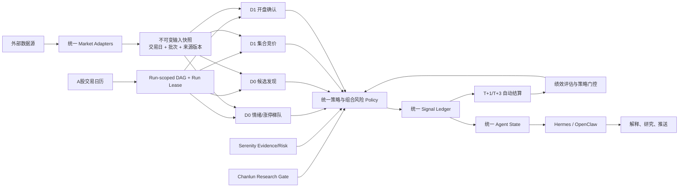

# 运行门禁、统一账本与数据访问层

本轮改造把原本分散在脚本约定中的架构能力变成确定性代码：

1. Hermes 与 OpenClaw 共用 runtime-neutral runner、可恢复 DAG 和运行租约。
2. cron 任务按 A 股交易日组成运行批次，并在启动业务子进程前验证依赖。
3. D0/D1 决策节点先固化输入快照，再从快照读回数据执行计算。
4. 推荐、信号、拟议交易、真实成交、监控状态和分阶段结算写入同一事件账本。
5. 方向性建议统一经过同一个质检、策略、T+1 和市场状态 Policy。
6. 账本投影为 Hermes/OpenClaw 共用的当前决策状态。
7. 外部行情统一经过共享 Adapter/transport，关键阈值从集中配置读取。
8. 缠论负责策略研究准入，Serenity 负责深研事实与风险，两者都通过 Policy 影响主线。

## 当前目标架构



## 跨运行时入口与 DAG

manifest 的外部入口默认走 DAG；DAG 内部才调用单任务 runner：

```bash
python scripts/run_agent_dag.py global-preopen --runtime hermes --emit-target
python scripts/run_agent_dag.py global-preopen --runtime openclaw --emit-target
```

DAG 按 `context_from` 做拓扑排序，只自动展开 `same_trading_date` / `same_batch`
依赖；`previous_trading_day` 依赖仍由 runner 的依赖门禁检查，避免把昨天的生产任务
误当成今天的节点重跑。已有成功依赖 artifact 会复用；计划触发的目标任务默认重跑，
避免高频竞价快照被错误永久复用。仅人工断点恢复时使用 `--reuse-targets`。

runner 在启动业务命令前，通过
`$A_STOCK_STATE_HOME/runtime/leases/{trading_date}/{batch_id}/{job_id}.lease`
原子目录租约阻止 Hermes 与 OpenClaw 同时执行同一节点。租约要求两端访问同一个物理
共享存储；两台机器各自设置同名本地目录并不能形成互斥。

## 不可变市场快照

成功且 stdout 为 JSON 的任务会生成输出快照；D0/D1 主线还会在计算前生成输入快照：

```text
$A_STOCK_STATE_HOME/market/snapshots/{trading_date}/{job_id}/{snapshot_id}.json
```

快照包含来源 provider、adapter 版本、生产者 Git commit/部署版本、交易日、批次、
抓取时间和 payload 哈希。候选发现、游资情绪、竞价快照、开盘确认均从刚写入的输入
快照重新读回 payload，再参与筛选或 Policy，避免“artifact 有快照、计算却用活数据”的
伪可复现状态。
相同内容重复写入会复用同一路径；不同内容不会覆盖旧快照。artifact 仅保存
`market_snapshot` 引用，消费者可追溯到本次决策实际使用的数据版本。

### 快照与 artifact 保留策略

`config/data_access.json` 的 `storage` 段统一控制生命周期：

- 输入快照默认保留 30 天，输出快照默认保留 90 天。
- cron artifact 默认保留 30 天；`job_runs.json` 本身由写入逻辑限长，不由 GC 删除。
- 最近 30 天状态文件中仍引用的 `snapshot_path` 不删除。
- 每个 dataset 至少保留最近 3 份，快照总量默认上限 4096 MB。
- 每次最多删除 10000 个主文件，避免一次维护任务造成长时间 I/O 峰值。

工作日 17:20 的 `snapshot-gc` 任务自动执行。容量仍超限时，先按时间删除未被引用的
最老快照；损坏或元数据不完整的快照会报告但不会自动删除。`.lock` 是并发协调文件，
不会被 unlink，避免旧、新 inode 同时被不同进程加锁。

部署前可先预演：

```bash
python scripts/snapshot_gc.py --json
python scripts/snapshot_gc.py --apply --json
```

#### 逐文件事实缓存

GC 需要的两类事实（快照的 `dataset` / `captured_at`，状态文件引用了哪些
`snapshot_path`）都只取决于文件内容，而两次日常运行之间绝大多数文件逐字节未变。
早期版本每天重新解析整个语料：2026-08-05 实测 2.4 GB、33.7 s，且以每个交易日约
1.3 s 的速度增长，逼近 120 s 预算。

现在这些事实按 `(size, mtime_ns)` 缓存在 `$A_STOCK_STATE_HOME/market/.gc_index.json`
（在快照树**之外**，因此既不会被当成快照扫描，也不计入容量上限）。缓存只在文件系统
能廉价证明文件两个维度都没变时才复用；键不匹配、条目损坏、版本不符、索引读不出来 ——
**任何一种情况都回落到重新读文件**。也就是说这个缓存的失效形态只有「慢」，不会变成
「对一个即将被删除的文件持有过期判断」。写入距今不足 2 秒的文件不进缓存，以规避
mtime 只精确到秒的挂载点上的同秒改写。

dry run 也会刷新缓存（它是派生缓存，不是保留决策的状态）。要强制全量重读用
`--no-index`；实测该开关与冷启动产出逐字段相同的计划。2026-08-20 在 4264 份真实快照 /
23071 个文件上实测：冷 29.6 s → 稳态 2.5 s，索引文件 4.2 MB。

保留期内保证输入版本可追溯；如果业务要求更长时间审计，应提高保留天数或把快照归档到
对象存储，而不是无限扩大在线状态卷。

## 运行批次与依赖门禁

每个 artifact 使用 `hermes_cron_artifact_v2`，名字为兼容历史 schema，不代表只能由
Hermes 生成。artifact 额外记录 `runtime` 和 `market_snapshot`。

- `trading_date`：任务所属的最近 A 股交易日。
- `batch_id`：格式为 `a-share-YYYYMMDD`。
- `dependency_gate`：逐项记录上游状态、交易日、年龄和阻断原因。
- `status=blocked`：必需依赖缺失、失败、过期、日期不匹配或批次不匹配。

`blocked` 时 runner 会写 artifact 和 `job_runs.json`，返回码为 `75`，但不会启动
`run.command`。这保证下游不会在上游数据不完整时继续生成看似正常的报告。

manifest 的 `dependency_policy` 支持：

- `trading_date`: `same_trading_date`、`same_batch`、`previous_trading_day` 或 `latest`
- `max_age_minutes`
- `optional_jobs`
- `accepted_statuses`

`validate_cron_manifest.py` 同时检查未知依赖和同批次依赖环。跨交易日边不参与
同批次环检测，例如次日竞价读取前一交易日候选池。

## 统一信号账本

规范账本为：

```text
$A_STOCK_STATE_HOME/skills/stock-triage/data/signal_ledger.jsonl
```

如果未设置 `A_STOCK_STATE_HOME`，路径回退到 `HERMES_HOME` 或 `~/.hermes`。

账本为 append-only JSONL，每个事件有稳定 `event_id`，并通过以下 ID 关联：

- `correlation_id`
- `recommendation_id`
- `signal_id`
- `trade_id`
- `monitor_id`
- `settlement_id`

当前写入 schema 为 `signal_ledger_event_v2`。读取端兼容
`signal_ledger_event_v1`，但不会迁移或改写历史行。

事件类型包括：

- `recommendation.created`
- `signal.opened`
- `trade.proposed`
- `trade.executed`
- `monitor.activated` / `monitor.deactivated` / `monitor.cancelled` / `monitor.closed`
- `signal.t1_settled`
- `signal.t3_settled`
- `signal.settled`（人工更正和旧版兼容）

只有公告与交易质检通过的 `buy/add` 推荐才生成 `signal.opened`。`hold/watch/avoid`
不会进入绩效样本。`trade.proposed` 不表示成交；只有 `portfolio_manager` 实际录入
开仓、加仓或清仓后才写 `trade.executed`。

`recommendation.created` payload 必须包含 `evidence_sources`：

```json
[
  {
    "source": "open-confirmation",
    "artifact": {"snapshot_id": "snap-...", "snapshot_path": "..."},
    "weight_hint": "primary"
  }
]
```

每项只引用推荐生成代码实际持有的上游 artifact，`weight_hint` 只能是
`primary`、`supporting` 或 `context`。旧事件缺失该字段时，读取端按
`{"source":"unknown","artifact":"unknown","weight_hint":"context"}` 兼容。
新写入历史仍保持 append-only，不回填旧 JSONL 行。

旧文件继续保留：

- `recommendations.json`
- `trade_history.json`
- `signal_history.json`
- `monitor_registry.json`

它们是兼容视图和既有部署数据，不再是跨模块关联的唯一事实源。绩效统计优先投影
`signal_ledger.jsonl`，再合并尚未迁移的旧 `signal_history.json` 记录。

交易日 16:10 的 `performance-daily` 先写 T+1 provisional，再在第三个持有交易日写
T+3 final。只有 final 结果进入最终策略门控；周度任务负责汇总并再次执行 gate：

```bash
python skills/stock-triage/scripts/performance_tracker.py --json --gate
```

因此结算完成后会自动按策略期望值更新 `strategy_registry.json`。
周报同时按 `evidence_sources[*].source` 汇总 primary 推荐数、T+3 命中率和平均
超额收益，并列出最近 30 天未作为 primary/supporting 出现过的证据管道。

## 统一 Policy 与 Agent 状态投影

`skills/common/decision_policy.py` 是所有方向性建议的确定性门禁。它统一处理：

- 公告和推荐质检未通过
- 策略被 registry 停用或禁止用于实盘 Agent
- A 股 T+1 卖出锁定
- `risk_off` 市场状态
- 单票和行业组合集中度
- 已通过研究闸门的缠论看空结构信号
- Serenity 财务质量/风险控制硬风险
- 趋势策略使用过期 Serenity 研究时的仓位折减

被拦截的原始买入意图仍写入 `trade.proposed` 供审计，但
`execution_status=not_executed`，不会生成 `signal.opened` 或进入绩效样本。

两端在开始主线分析或解释前必须刷新并读取同一个投影：

```bash
python scripts/agent_runtime_context.py
```

输出写入 `$A_STOCK_STATE_HOME/agent_state/agent_state_latest.json`，包含当前信号、
待结算信号、持仓、有效监控和策略门控。缺失或 schema 非法时
`load_agent_state(required=True)` 直接失败；Hermes/OpenClaw 不得依赖各自对话历史
重建这些事实。`agent_state_projector.py` 仍可单独用于定时投影。

## 缠论与 Serenity 在主线的位置

### chanlun-backtest：研究验证与策略准入层

- 离线负责 IS/OOS、成本、对照组和统计检验。
- `research_gate --register` 把每类结构信号的准入结论写入 `strategy_registry.json`。
- D0 候选发现对输入快照中的 K 线运行 `chan_structure.analyze`，把近期三买/三卖/
  顶底背驰作为结构化证据随候选向竞价和开盘传递。
- 未过闸信号只展示；已过闸的看空信号可阻断买入。看多信号只能提供支持，不能绕过
  公告、可成交性、组合风险和市场状态门禁。

### serenity-investment-research：深研证据与硬风险层

- 离线/按需产出来源分级、证据台账、六维 scorecard、估值情景和熊市案例。
- `deep_research_cache.py` 将结论缓存并按新鲜度衰减。
- 打板 lane 不要求每只票都先完成深研；缺失 Serenity 不单独阻断交易。
- 一旦已有深研，`financial_quality <= 2/5` 或 `risk_control <= 2/5` 会作为硬风险阻断
  正向建议；趋势 lane 使用过期研究时仓位减半。
- 研究证据写入推荐和 Signal Ledger，Agent State 因而能解释“为什么通过/为什么被拦截”。

## 数据 Provider 与配置

共享入口：

- `skills/common/http_client.py`：bytes/text/json、最多两次尝试、类型化错误、抓取时间。
- `skills/common/data_provider.py`：腾讯行情、SerpAPI 等 provider adapter。
- `skills/common/market_adapters.py`：D0/D1 腾讯行情、K 线、盘口和 AkShare 涨停池入口。
- `skills/common/a_stock_http.py`：A 股历史兼容 API，复用同一异常类型。
- `config/data_access.json`：provider、持仓风控、盘中监控、资讯监控，以及全球市场
  数据源开关、标的池、传导阈值和 A 股观察映射。

配置读取失败时使用代码内历史默认值，避免旧部署因缺少新配置文件直接中断。
配置整段或字段类型损坏时也会回退到安全默认值。全球监控的 Yahoo 主源失败时，
会按同一配置启用新浪指数备用源；备用源不足时仍保持 fail-closed，不输出方向判断。

业务脚本不得直接调用 `urllib.request.urlopen`。新增数据源时先在共享 transport/provider
实现 adapter，再由业务脚本调用。

东方财富的资金流、事件、机构和筹码接口统一经过
`skills/common/eastmoney_intelligence.py`。该 adapter 对 HTTP 200 中的业务失败和 schema
漂移做严格校验，并在共享状态卷上协调限速与熔断。必要的解禁、两融、股东户数证据按数据集
分别校验新鲜度；缺失或过期时 Policy fail-closed。完整协议见
[`eastmoney-resilience.md`](eastmoney-resilience.md)。

## 部署检查

```bash
python scripts/validate_cron_manifest.py cron/hermes-cron-manifest.json
pytest -q
python scripts/smoke_test.py
```

同机双运行时可设置相同的 `A_STOCK_STATE_HOME`。跨机器部署时，该路径必须指向同一个
共享挂载卷或由外部调度器保证单写；仅使用相同路径字符串无效。两端还必须使用同一份
仓库版本和兼容 Python 环境，否则会各自生成账本、快照和监控状态。
