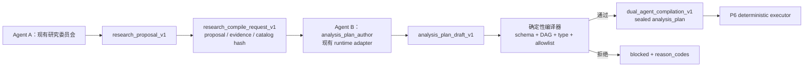

# PAT P5：双 Agent 编译链

状态：已实现，等待 PR 验证与评审
范围：研究计划的生成与交接；不执行计划，不影响实时排名或交易。

## 接入的 Agent

P5 没有引入新的 Agent 框架、常驻进程或模型供应商。它在现有运行面上定义两个逻辑角色：

| 角色 | 实际接入 | 新增内容 | 明确不负责 |
|---|---|---|---|
| Agent A：研究交互/问题澄清 | 现有 research bus、research consumer、Hermes/OpenClaw runtime adapter、多专家 synthesis | 无新 Agent；把既有 `research_proposal_v1` 作为编译起点 | 不写代码、不执行分析、不修改事实层 |
| Agent B：计划编写 | 现有 `agent_runtime_adapter`，逻辑 role 为 `analysis_plan_author` | 一个新的受限角色和 `analysis_plan_draft_v1` 输出契约 | 不运行 Python、不写状态、不直接生成 sealed plan |
| 确定性编译器 | `dual_agent_compiler.py` + 既有 `analysis_plan.py` | request/draft/handoff 的 hash、状态机和失败原因 | 它不是 Agent，不做开放式推理 |

Hermes、OpenClaw 和测试用 fake adapter 共享同一 `AgentRunRequest`。因此 P5 新增的是协议层，
不是第三套调度器。运行宿主仍负责提供实际模型 turn；仓库不会伪造一个“代码 Agent 服务”。

## 编译链

### 1. Agent A 的输出绑定

`build_compile_request()` 只接受既有 `research_proposal_v1`，并要求：

- task ID、synthesis ref/hash 完整；
- `policy_gate_required=true`；
- `live_effect=none_until_strategy_registry_and_decision_policy_pass`；
- evidence pack ref 与当前 dataset catalog hash 显式绑定。

请求同时冻结当时可用的 dataset contract hash 和 allowlisted operators，再计算
`request_hash`。问题文本被改一个字、目录更新或算子集合变化，旧 request 都不能继续使用。

### 2. Agent B 的权限包络

计划编写角色只得到两个工具名：

- `read_evidence_pack`
- `read_dataset_catalog`

它没有 shell、Python 执行、网络抓取或状态写权限。既有 `agent_run_contract` 会在读取草稿
之前拒绝未授权工具和对 `portfolio.json`、`signal_ledger.jsonl`、cron manifest、monitor
registry、candidate lifecycle、strategy registry 的任何声明写入。

整个 compile request 放在 `AgentRunRequest.model_metadata.compile_request`，因此实际
Hermes/OpenClaw turn 看到的是同一个 hash-bound 输入，而不是从聊天历史猜测问题或数据集。

### 3. 模型草稿不是计划

Agent B 只能返回 `analysis_plan_draft_v1`，并必须：

- 绑定 task ID、role 和 request hash；
- 引用 evidence pack 内真实存在的 evidence refs；
- 给出 `[0, 1]` confidence；
- 把候选计划放在 `plan` 字段。

`analysis_plan.seal_plan()` 随后重新执行字段白名单、dataset contract/catalog hash、DAG
拓扑、输入/输出类型和 operator allowlist 校验。`python_eval`、任意 import、未知参数、循环
依赖或问题漂移都只能产生 `blocked`，不会降级成“尽量执行”。

### 4. 可审计交接

成功输出 `dual_agent_compilation_v1`，包含：

- research proposal、evidence pack、catalog、request、Agent result 和 sealed plan 的 hash/ref；
- 实际 runtime、model 与冻结的 `compiled_at`；
- `handoff_status=ready_for_deterministic_execution`；
- `research_only=true`、`trading_action=none`。

交接 artifact 以 `compilation_hash` 内容寻址保存，读取时重新计算 hash。blocked 结果也有
稳定 hash 和明确 reason codes，便于进入 P3 的失败评测飞轮。

## 生产接入方式

Hermes/OpenClaw 宿主应：

1. 从 research bus 已落盘的 proposal 与 evidence pack 构造 compile request；
2. 把宿主的真实 turn callable 传给 `run_compile_chain()`；
3. 只将 `status=compiled` 的结果交给 P6；
4. 将 blocked 原因送入观测/评测，不做自动重试式放宽权限。

P5 没有新增定时任务，也没有声称当前生产流量已经调用该入口。代码与测试证明的是协议和
实现可用；上线采用率、模型计划质量和投资结果仍是未知项。

## P6 前置条件

P6 消费前必须重新验证 `compilation_hash`、request/catalog/plan hash，并要求 handoff status
完全匹配。即使 P5 编译成功，P6 仍需独立加载真实输入、做 point-in-time 检查、在隔离执行器
中运行白名单算子，并生成确定性 validation evidence；P5 的“compiled”不等于“executed”。
