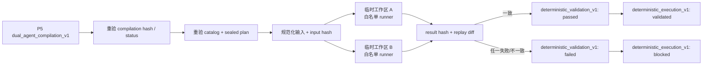

# PAT P6：确定性执行与验证层

状态：已实现，等待 PR 验证与评审
范围：执行 `analysis_plan_v1` 研究诊断；不执行证券交易，不写事实层或决策层状态。

## 目标

P5 解决“模型只能写草稿，确定性编译器才能封装计划”；P6 再解决另一个常被混淆的问题：
**计划成功编译，不代表代码已正确执行，更不代表结果可相信。**

P6 因此不接受 Agent 的“运行成功”自述。它重新验证每个上游 identity，在隔离环境中调用
既有白名单 analysis engine，校验运行结果，并用同一输入重放第二次。只有两次结果完全一致
才生成 passed validation。

## 执行链



## 上游重验证

`execute_compilation()` 在启动子进程前要求：

- `compilation_hash` 能从 artifact 内容重算；
- `status=compiled` 且 `handoff_status=ready_for_deterministic_execution`；
- `research_only=true`、`trading_action=none`；
- compilation 的 catalog hash 等于当前 seal 后的 catalog；
- sealed plan 的 plan hash、dataset contract、DAG 拓扑、类型流和 operator allowlist 仍然有效。

因此，即使有人重算了外层 compilation hash，向 plan 中加入 `python_eval` 仍会在创建子进程前
失败。P5 的模型结果 hash 不替代 P6 的 plan validator。

## 自定义隔离执行器

执行器只构造固定 argv 调用现有 `scripts/run_analysis_plan.py`，不拼接 shell 字符串：

- `shell=false`；
- 每次运行使用不同的 `TemporaryDirectory`；
- plan、inputs、catalog、cache 与 `A_STOCK_STATE_HOME` 都位于该临时目录；
- 子进程仅继承 PATH、LANG 等运行必需值，不继承父进程 token、API key 或其他业务环境变量；
- 固定 `PYTHONHASHSEED=0` 和 `TZ=Asia/Shanghai`；
- 默认 30 秒超时，允许范围 1–300 秒；
- stdout 上限 2 MB；stderr 不进入 artifact，避免秘密或无界日志泄漏；
- 临时目录在每次运行后清理。

该隔离层不是通用代码沙箱。安全性的第一层仍是 analysis plan 只能引用仓库内预注册的
确定性算子；隔离子进程提供的是状态、环境、超时和失败域分离。

## 确定性验证

每个 plan 用相同 sealed catalog 和规范化 inputs 在两个独立工作区运行。父进程验证：

1. 子进程退出码为 0；
2. 输出是 `analysis_run_v1`；
3. `research_only=true`、`trading_action=none`；
4. result hash 在把展示用 `cached` 还原为原始身份后可重算；
5. 两次规范化 run（outputs、lineage、input/plan/catalog/cache/result hash）完全相同。

任何缺失字段、coverage 不足、未来/错误时点、进程超时、非 JSON 输出、hash 不匹配或重放
差异都会生成 `blocked`，reason codes 原样保留，不会被解释为中性结果。

## Validation evidence

成功产物包含 `deterministic_validation_v1`：

- compilation、plan、catalog、input 与 result hash；
- 固定 `validated_at`；
- 六项检查的 passed 记录；
- `replay_count=2` 与 `replay_deterministic=true`；
- 独立 `validation_hash`。

外层 `deterministic_execution_v1` 另有 `execution_hash`。读取时同时重算外层和嵌套
validation hash，并核对 compilation/input/result/status/replay 的交叉绑定；只重算外层 hash
无法伪造内部 passed 状态。

## 操作入口

```bash
python scripts/execute_compiled_analysis.py \
  --compilation /path/to/dual-agent-compilation.json \
  --inputs /path/to/execution-inputs.json \
  --catalog config/dataset_catalog.json \
  --validated-at '2026-08-10T10:00:00+08:00' \
  --output /path/to/execution-result.json
```

CLI 无论 passed 或 blocked 都会把内容寻址 artifact 写入
`A_STOCK_STATE_HOME/research-committee/validated_executions`；blocked 返回码为 2，便于调度器
显式失败关闭。

## 与 P4/P3 的闭环边界

- 后续把 P6 接到 P4 写回层时，适配器必须只消费 `status=validated` 且嵌套 validation 重新
  验 hash 的输出；是否正式登记为 dataset 仍需 catalog review。本 PR 尚未完成跨 PR 的
  自动写回布线。
- blocked reason、输入 ref、plan hash 和 validation artifact 可进入 P3 候选评测队列；进入
  benchmark 仍需人工审核。
- 本 PR 不新增 cron job，也不声称生产研究流量已经接入。工程验证不能代替线上采用率、
  真实用户验收或投资结果。
